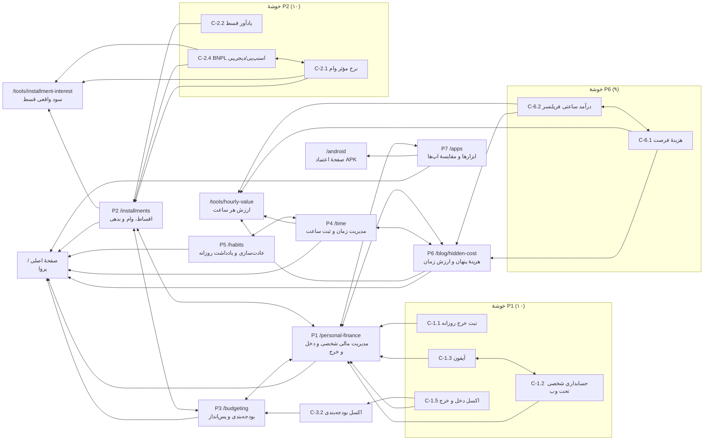

# «پروا» — ممیزی سئوی فنی، تحلیل کلمات کلیدی فارسی و نقشهٔ ستون–خوشه (Pillar–Cluster)

> تاریخ: ۶ مهر ۱۴۰۵ (۲۸ سپتامبر ۲۰۲۶). وضعیت: **فقط پیشنهاد** — هیچ فایلی از لندینگ یا اپ تغییر نکرده است.
> ورودی‌ها: `doc/product-proposal.md` (§۱، §۸، §۱۲)، `doc/landing/*` (به‌ویژه ۰۴ و ۰۶)، `doc/landing/site/index.html`، `doc/inbound-marketing-plan.md` (§۶.۳)، `doc/blog-01-hidden-cost.md`، `content/`، کد `src/middleware.ts` و `src/app/layout.tsx`، دریافت زندهٔ `parvaapp.ir` و `my.parvaapp.ir` (با curl، ۶ مهر ۱۴۰۵)، پیشنهادهای خودکار گوگل فارسی (`suggestqueries.google.com`، `hl=fa&gl=ir`) و جست‌وجوی وب.
>
> **هشدار دربارهٔ داده:** هیچ ابزار کلمهٔ کلیدی پولی (Ahrefs، Semrush، Similarweb) به این جلسه وصل نبود. بنابراین **همهٔ ردیف‌های «حجم» و «سختی» تخمین‌اند**، نه عدد. مبنای تخمین در §۲.۱ آمده است. تنها دادهٔ واقعیِ دست‌اول این سند، (۱) پاسخ‌های سرورهای خود پروا و (۲) پیشنهادهای خودکار گوگل است — پیشنهاد خودکار نشان می‌دهد عبارتی **تقاضای تکرارشونده** دارد، نه اینکه چقدر.

---

## فهرست

- [۰. خلاصهٔ اجرایی](#۰-خلاصهٔ-اجرایی)
- [۱. ممیزی سئوی فنی](#۱-ممیزی-سئوی-فنی)
- [۲. تحقیق کلمات کلیدی](#۲-تحقیق-کلمات-کلیدی)
- [۳. خوشه‌بندی و نقشهٔ ستون–خوشه](#۳-خوشهبندی-و-نقشهٔ-ستونخوشه)
- [۴. نگاشت کلمه به صفحه، ساختار URL و ریسک هم‌خواری](#۴-نگاشت-کلمه-به-صفحه-ساختار-url-و-ریسک-همخواری)
- [۵. سه بریف نمونهٔ محتوا](#۵-سه-بریف-نمونهٔ-محتوا)
- [۶. تقویم انتشار ۹۰ روزه و برنامهٔ اندازه‌گیری](#۶-تقویم-انتشار-۹۰-روزه-و-برنامهٔ-اندازهگیری)
- [پیوست: منابع](#پیوست-منابع)

---

## ۰. خلاصهٔ اجرایی

**وضعیت کلی: پایهٔ فنی تمیز، ولی عملاً «چیزی برای رتبه گرفتن» وجود ندارد.** `parvaapp.ir` یک صفحهٔ تک‌فایلی سریع و درست‌ساخته است (`lang="fa" dir="rtl"`، یک H1، سلسله‌مراتب تیتر منظم، بدون تصویر سنگین، FAQ با `<details>`)؛ اما کل سایت **یک URL** است، `robots.txt` و `sitemap.xml` ندارد، canonical و داده‌های ساخت‌یافته ندارد، نسخه‌های `http://` و `www` بدون ریدایرکت همان محتوا را تکراری سرو می‌کنند، و صفحه‌های ورود/ثبت‌نام اپ (`my.parvaapp.ir/login`) بدون `noindex` در دسترس خزنده‌اند و با عنوان لاتین «parva» با صفحهٔ اصلی بر سر نام برند رقابت می‌کنند.

**بزرگ‌ترین نقطهٔ قوت:** محصول واقعاً چیزهایی دارد که رقبای «دخل و خرج» ندارند و جست‌وجوی واقعی پشتشان هست: **نسخهٔ وب** (پیشنهاد خودکار: «برنامه دخل و خرج نسخه وب»، «حسابداری شخصی تحت وب»، «…برای آیفون تحت وب»)، **اقساط با تاریخ شمسی و سود واقعی** («سود واقعی وام اسنپ پی/دیجی پی»، «یادآور قسط»)، و مفهوم اختصاصی **هزینهٔ پنهان** که جست‌وجوی مدرسه‌ای پرحجمی دارد.

**سه اولویت اول:**
1. **رفع پایه‌های فنی در یک روز** (§۱.۳ ردیف ۱ تا ۶): ریدایرکت ۳۰۱ به `https://parvaapp.ir/`، `robots.txt` + `sitemap.xml`، canonical + OG کامل + JSON-LD، و `noindex` کل `my.parvaapp.ir`.
2. **ساختن سه صفحهٔ «پول‌ساز» غیرمقاله** پیش از وبلاگ: `/tools/installment-interest` (سود واقعی قسط)، `/tools/hourly-value` (ارزش هر ساعت)، `/android` (صفحهٔ اعتماد APK). این سه صفحه هم کلمهٔ تجاری/ابزاری می‌گیرند و هم لینک طبیعی جذب می‌کنند.
3. **شروع خوشهٔ «اقساط و بدهی» و «هزینهٔ پنهان»** — بیشترین هم‌پوشانی بین تقاضای جست‌وجو و قابلیت متمایز پروا، با رقابت کمتر از «حسابداری شخصی».

**ده کلمهٔ کلیدی اولویت‌دار** (ترتیب = اولویت اجرا، نه حجم):

| # | کلمه | چرا | صفحهٔ مقصد |
|---|---|---|---|
| ۱ | محاسبه سود واقعی وام / سود واقعی قسط | حجم بالا، ابزار داریم، BNPL (اسنپ‌پی، دیجی‌پی) موج تازه است | `/tools/installment-interest` |
| ۲ | برنامه مدیریت اقساط / یادآور قسط | تجاری، قابلیت شمسی و یادآور واقعی داریم، رقبا اپ‌های تک‌کاره‌اند | `/installments` (ستون) + `/` |
| ۳ | هزینه پنهان چیست / هزینه های پنهان زندگی | مفهوم مالکیتی برند؛ حجم مدرسه‌ای (اقتصاد دهم) بالا | `/blog/hidden-cost` (ستون) |
| ۴ | برنامه دخل و خرج نسخه وب / حسابداری شخصی تحت وب | شکاف واقعی: بیشتر رقبا فقط اندروید | `/` + `/personal-finance` |
| ۵ | اپلیکیشن حسابداری شخصی آیفون (از طریق وب) | کاربران آیفون در ایران اپ فارسی کم دارند؛ پروا وب است | مقاله + `/` |
| ۶ | هزینه فرصت چیست (با مثال) | حجم بالا، سختی متوسط، پل مستقیم به «ارزش هر ساعت» | خوشهٔ ستون ۶ |
| ۷ | ثبت ساعت کاری / اپلیکیشن ثبت ساعت کاری | تجاری، رقبا سازمانی‌اند (حضور و غیاب) نه شخصی | `/time` (ستون) |
| ۸ | ثبت ساعت مطالعه (اپلیکیشن/جدول) | فصلی و همین حالا (شروع سال تحصیلی)، مخاطب دوم پروا | خوشهٔ ستون ۴ |
| ۹ | بودجه بندی شخصی / قانون ۵۰ ۳۰ ۲۰ / اکسل بودجه بندی شخصی | اطلاعاتی پرتکرار؛ قابلیت بودجه و هدف پس‌انداز داریم | `/budgeting` (ستون) |
| ۱۰ | برنامه عادت سازی فارسی / ردیاب عادت | رقبا اپ‌های خارجی ترجمه‌نشده‌اند | `/habits` (ستون) |

**ستون‌ها (۷):** ۱) مدیریت مالی شخصی و دخل و خرج · ۲) اقساط، وام و بدهی · ۳) بودجه‌بندی و پس‌انداز · ۴) مدیریت زمان و ثبت ساعت · ۵) عادت‌سازی و یادداشت روزانه · ۶) هزینهٔ پنهان و ارزش زمان · ۷) ابزارها و مقایسهٔ اپلیکیشن‌ها.

**تله‌های معنایی که باید از آن‌ها دوری کرد** (از پیشنهادهای خودکار گوگل — §۲.۳): «بودجه بندی» تنها = بودجه‌بندی کنکور؛ «ارزش ساعت» = قیمت ساعت مچی؛ «ردیابی زمان» = ردیابی گوشی سرقتی؛ «برنامه عادت» = عادت ماهانه؛ «کجا پولم…» = سرمایه‌گذاری؛ «برنامه مدیریت زمان» = کنترل زمان استفاده از گوشی.

---

## ۱. ممیزی سئوی فنی

### ۱.۱ (الف) سورس لندینگ در مخزن — `doc/landing/site/index.html`

> فایل روی سرور **بایت‌به‌بایت با همین فایل مخزن یکسان است** (`cmp` روی نسخهٔ دریافتی از `https://parvaapp.ir/`). پس هر یافته دربارهٔ سورس، دربارهٔ سایت زنده هم صادق است.

| بررسی | وضعیت | جزئیات |
|---|---|---|
| `<html lang="fa" dir="rtl">` | ✅ قبول | درست. |
| `<meta charset>` و viewport | ✅ قبول | `width=device-width, initial-scale=1`. |
| `<title>` | ⚠️ هشدار | «پروا \| سیستم‌عامل شخصی — دفتر وقت، پول و آنچه می‌سازی» (حدود ۵۲ نویسه). طول خوب است ولی **هیچ عبارتی که کسی جست‌وجو می‌کند** ندارد؛ «سیستم عامل شخصی» در پیشنهادهای گوگل برای مالی/زمان ظاهر نمی‌شود. |
| meta description | ⚠️ هشدار | خوب نوشته شده، ولی «رایگان تا ۵ دی» تاریخ‌دار است و بعد از دی باید عوض شود (در سند ۰۴ هم علامت خورده). کلمات «دخل و خرج»، «اقساط»، «تقویم شمسی» ندارد. |
| canonical | ❌ رد | وجود ندارد. با توجه به اینکه `http://`، `www` و `/index.html` همه ۲۰۰ می‌دهند (§۱.۲)، canonical ضروری است. |
| hreflang | ➖ لازم نیست | سایت تک‌زبانه است؛ hreflang برای سایت تک‌زبان سودی ندارد. اگر اضافه شد، فقط self-referencing `fa-IR` + `x-default` به همان URL. اولویت پایین. |
| Open Graph / Twitter | ❌ رد | فقط `og:title` و `og:description`. نبود `og:image` یعنی پیش‌نمایش لینک در تلگرام/ایکس/لینکدین بدون تصویر است — برای استراتژی تلگرام‌محور پروا این هزینهٔ مستقیم تبدیل است. `og:url`، `og:type`، `og:locale`، `og:site_name`، `twitter:card` هم نیست. |
| داده‌های ساخت‌یافته (JSON-LD) | ❌ رد | هیچ‌کدام: نه `SoftwareApplication`، نه `Organization`/`WebSite`، نه `FAQPage` — در حالی که ۱۴ سؤال FAQ آمادهٔ HTML وجود دارد. |
| H1 | ✅ قبول (با یک نکته) | دقیقاً یک H1: «آخر ماه می‌دانی پولت کجا رفت. وقتت را نه.» — خوب برای تبدیل، صفر برای کلمهٔ کلیدی. سند ۰۴ درست گفته که تیتر را برای کلمه بازنویسی نکنیم؛ راه‌حل، کلمه در **eyebrow** و **جملهٔ اول** است (§۱.۴ ردیف ۸). |
| H2/H3 | ✅ قبول | ۱۵ H2 منطقی، H3 ها زیر H2 درست. همه شعاری‌اند؛ دو H2 می‌توانند یک عبارت جست‌وجوپذیر را طبیعی جذب کنند: «اقساط و یادآوری» (H3 فعلی) و «بودجه و هدف» (H3 فعلی) — همین حالا خوب‌اند. |
| متن قابل‌خزش | ✅ قبول | همهٔ متن در HTML است (نه تصویر، نه رندر JS). FAQ با `<details>` — گوگل محتوای بسته را ایندکس می‌کند. |
| تصاویر و alt | ⚠️ هشدار | **هیچ ``** وجود ندارد (۴۵ SVG درون‌خطی). یعنی: صفر حضور در جست‌وجوی تصویر، و هیچ اسکرین‌شات واقعی — که سند ۰۴ خودش ۸ عدد را لازم دانسته. |
| فونت (Core Web Vitals) | ⚠️ هشدار | `Vazirmatn-Variable.ttf` = **۲۴۱ کیلوبایت TTF**، preload شده، بدون زیرمجموعه‌سازی، با `Content-Type: application/octet-stream`. سند ۰۴ گفته `woff2` — اجرا نشده. نسخهٔ woff2 زیرمجموعه (عربی/فارسی + لاتین پایه) معمولاً کمتر از نصف حجم است. `font-display: swap` هست (خوب). |
| JS و «reveal» | ⚠️ هشدار | ۷۹ عنصر `.rv` با `opacity:0` شروع می‌شوند و فقط با IntersectionObserver ظاهر می‌شوند. اگر اسکریپت خطا بدهد یا مسدود شود، بخش بزرگی از صفحه نامرئی می‌ماند. H1 و هیرو `.rv` ندارند (پس LCP آسیب نمی‌بیند). راه‌حل: `<noscript>` یا دروازهٔ کلاس `js` (§۱.۴ ردیف ۱۱). |
| حجم HTML | ✅ قبول | ۱۴۰ کیلوبایت خام، **۳۷ کیلوبایت gzip** (سرور gzip می‌کند). CSS و JS درون‌خطی‌اند — برای یک صفحه این خوب است (یک رفت‌وبرگشت). |
| موبایل | ✅ قبول | موبایل‌اول، هدف لمسی ۴۴+px، بدون اسکرول افقی (با `overflow-x:hidden`)، `prefers-reduced-motion` رعایت شده. |
| لینک‌سازی داخلی | ❌ رد (ساختاری) | همهٔ لینک‌های فوتر لنگر (`#hourly`، `#faq`…) هستند؛ سایت **هیچ صفحهٔ دومی** برای لینک دادن ندارد. تمام CTA ها به `my.parvaapp.ir` می‌روند. این مهم‌ترین محدودیت سئوی سایت است. |
| محتوای کهنه | ⚠️ هشدار | فوتر: «نسخهٔ اندروید ۱٫۷٫۰»؛ API زنده (`/api/app/version`) می‌گوید **۱.۷.۲**. نمونهٔ «مسیر» هنوز متن الگوست (سند ۰۶). |
| آنالیتیکس | ❌ رد | هیچ ابزار آماری نیست (دکمه‌ها `data-cta` دارند و آماده‌اند). بدون این، هیچ‌کدام از §۶ قابل‌اندازه‌گیری نیست. |
| دسترس‌پذیری که به سئو می‌خورد | ✅ قبول | لینک «رفتن به محتوای اصلی»، `<main>`، `aria-label`ها، `bdi` برای اعداد. |

### ۱.۲ (ب) دامنه‌های زنده — دریافت مستقیم، ۶ مهر ۱۴۰۵

> WebFetch از این محیط به دامنه‌های `.ir` نمی‌رسید (پراکسی محلی timeout می‌داد)؛ بررسی با `curl --noproxy` مستقیم انجام شد. خروجی‌ها کلمه‌به‌کلمه‌اند.

| URL | پاسخ | معنی |
|---|---|---|
| `https://parvaapp.ir/` | `200`، `text/html`، ۱۴۰٬۱۷۹ بایت، `Server: nginx`، gzip فعال | همان فایل مخزن. |
| `http://parvaapp.ir/` | **`200`** (بدون ریدایرکت) | ❌ HTTPS اجباری نیست. سند ۰۶ «Force SSL» را خواسته — اعمال نشده. |
| `https://www.parvaapp.ir/` و `http://www.parvaapp.ir/` | **`200`** (بدون ریدایرکت) | ❌ چهار نسخهٔ تکراری از یک صفحه. |
| `https://parvaapp.ir/index.html` | **`200`** | ❌ نسخهٔ پنجم. |
| `https://parvaapp.ir/robots.txt` | **`404`** (صفحهٔ خطای پیش‌فرض Apache، `iso-8859-1`) | ❌ ندارد. |
| `https://parvaapp.ir/sitemap.xml` | **`404`** | ❌ ندارد. |
| `https://parvaapp.ir/<هر-مسیر-ناموجود>` | `404` واقعی | ✅ soft-404 نیست. ولی صفحهٔ ۴۰۴ فارسی/برندی هم نیست. |
| هدرهای امنیتی لندینگ | بدون HSTS، بدون `Cache-Control` صریح | ⚠️ `my.parvaapp.ir` HSTS با `includeSubDomains` دارد ولی این فقط زیردامنه‌های **خودش** را پوشش می‌دهد، نه `parvaapp.ir`. |
| `https://my.parvaapp.ir/` | `307` ← `/login?next=%2F` | طبیعی برای اپ. |
| `https://my.parvaapp.ir/robots.txt` | **`307` ← `/login?next=%2Frobots.txt`** | ❌ middleware آن را به صفحهٔ ورود می‌فرستد. گوگل ریدایرکت را دنبال می‌کند، به HTML صفحهٔ ورود می‌رسد و آن را robots نامعتبر (= «همه مجاز») تفسیر می‌کند. |
| `https://my.parvaapp.ir/sitemap.xml` | `307` ← login | (نباید هم داشته باشد.) |
| `https://my.parvaapp.ir/login` | `200`، `<title>parva \| سیستم‌عامل شخصی</title>`، description همان، **بدون `meta robots` و بدون `X-Robots-Tag`** | ❌ **صفحهٔ ورود قابل‌ایندکس است.** عنوان با «parva» لاتین با صفحهٔ اصلی بر سر جست‌وجوی برند رقابت می‌کند و در نتایج «parva \| …» می‌نشیند. |
| `https://my.parvaapp.ir/register` | `200`، بدون noindex | ❌ همان. |
| `https://my.parvaapp.ir/nonexistent` | `307` ← login | همهٔ مسیرهای ناموجود به `/login?next=…` می‌روند؛ اگر لینکی از بیرون به مسیر عجیبی بخورد، نسخه‌های بی‌پایان `login?next=` ساخته می‌شود — دلیل دیگر برای noindex. |
| `https://my.parvaapp.ir/parvaapp.apk` | `200`، `application/vnd.android.package-archive`، ۶٬۱۲۲٬۸۱۰ بایت | ✅ کار می‌کند. پیشنهاد: `X-Robots-Tag: noindex` تا خود فایل در نتایج نیاید و جست‌وجوی «دانلود پروا» به صفحهٔ `/android` برسد. |
| `https://my.parvaapp.ir/api/app/version` | `{"latestVersionName":"1.7.2",…}` | ✅ منبع درست برای نسخه در صفحهٔ `/android`. |

**جمع‌بندی ایندکس‌پذیری اپ:** `my.parvaapp.ir` نباید در نتایج باشد و الان هیچ مانعی ندارد. کد مربوط: `src/app/layout.tsx` (متادیتای ریشه بدون `robots`) و `src/middleware.ts` (خط `PUBLIC_FILE_PATHS = ["/parvaapp.apk"]` — `robots.txt` در فهرست استثنا نیست).

### ۱.۳ فهرست اصلاحات به ترتیب اولویت

| # | اصلاح | شدت | تلاش | کجا |
|---|---|---|---|---|
| ۱ | ریدایرکت ۳۰۱ همهٔ نسخه‌ها به `https://parvaapp.ir/` (http، www، `/index.html`) | بحرانی | ۳۰ دقیقه | DirectAdmin / `.htaccess` |
| ۲ | `noindex` کل `my.parvaapp.ir` (متادیتا + هدر) و آزاد کردن `/robots.txt` از middleware | بحرانی | ۱ ساعت + استقرار | `src/app/layout.tsx`، `next.config.mjs`، `src/middleware.ts`، `src/app/robots.ts` |
| ۳ | `robots.txt` و `sitemap.xml` روی `parvaapp.ir` | بالا | ۱۵ دقیقه | کنار `index.html` |
| ۴ | canonical + OG کامل + `og:image` ۱۲۰۰×۶۳۰ | بالا | ۱ ساعت (با ساخت تصویر) | `<head>` |
| ۵ | JSON-LD: `Organization` + `WebSite` + `SoftwareApplication` + `FAQPage` | بالا | ۱ ساعت | `<head>` |
| ۶ | ثبت در Google Search Console (Domain property با DNS TXT) و Bing Webmaster؛ ارسال sitemap | بالا | ۳۰ دقیقه | §۶.۲ |
| ۷ | فونت: TTF ← woff2 زیرمجموعه + `Content-Type: font/woff2` + کش بلندمدت | متوسط | ۱ ساعت | `fonts/`، `.htaccess` |
| ۸ | title و meta description با کلمهٔ کلیدی؛ eyebrow کلمه‌دار | متوسط | ۱۵ دقیقه | `<head>`، هیرو |
| ۹ | عنوان فارسی برای صفحات اپ («پروا — ورود») به‌جای «parva \| …» | متوسط | ۱۵ دقیقه | `src/app/(auth)/…` |
| ۱۰ | ساخت صفحات دوم: `/android`، `/tools/installment-interest`، `/tools/hourly-value`، `/privacy`، `/blog/` | بالا (راهبردی) | چند روز | §۴ |
| ۱۱ | fallback بدون JS برای `.rv` | پایین | ۵ دقیقه | `<head>` |
| ۱۲ | صفحهٔ ۴۰۴ فارسی با لینک به خانه، ابزارها و وبلاگ | پایین | ۳۰ دقیقه | `ErrorDocument 404` |
| ۱۳ | به‌روزکردن «نسخهٔ اندروید ۱٫۷٫۰» ← از API یا دستی ۱٫۷٫۲ | پایین | ۵ دقیقه | فوتر |
| ۱۴ | اسکرین‌شات‌های واقعی با `alt` توصیفی، `width`/`height`، WebP، `loading="lazy"` (جز هیرو) | متوسط | نیم‌روز | بخش‌های ۸، ۹، ۱۰ لندینگ |
| ۱۵ | آنالیتیکس خودمیزبان (Umami) + رویدادها | بالا (برای سنجش) | ۲ ساعت | §۶.۲ |

### ۱.۴ کد دقیق اصلاحات

#### ردیف ۱ — ریدایرکت‌ها (`.htaccess` در `public_html` لندینگ)

ابتدا گزینه‌های خود DirectAdmin را امتحان کن (**SSL Certificates ← Force SSL with https redirect**، و در **Domain Setup** گزینهٔ ریدایرکت `www` به دامنهٔ بدون `www`). اگر نبود یا کار نکرد، این `.htaccess` (صفحهٔ خطای ۴۰۴ سرور، Apache است؛ پس `.htaccess` خوانده می‌شود):

```apache
# parvaapp.ir — یک نسخهٔ واحد: https، بدون www، بدون /index.html
RewriteEngine On

# http یا www  →  https://parvaapp.ir
RewriteCond %{HTTPS} !=on [OR]
RewriteCond %{HTTP_HOST} ^www\.parvaapp\.ir$ [NC]
RewriteRule ^ https://parvaapp.ir%{REQUEST_URI} [L,R=301]

# /index.html  →  /
RewriteCond %{THE_REQUEST} \s/+index\.html[\s?] [NC]
RewriteRule ^index\.html$ https://parvaapp.ir/ [L,R=301]

# صفحهٔ ۴۰۴ فارسی (بعد از ساختن 404.html)
ErrorDocument 404 /404.html
```

> ⚠️ اگر nginx جلوی Apache SSL را خاتمه می‌دهد، `%{HTTPS}` ممکن است همیشه `off` باشد و حلقهٔ ریدایرکت بسازد. در آن صورت شرط اول را با `RewriteCond %{HTTP:X-Forwarded-Proto} !https` عوض کن. بعد از هر تغییر بسنج:
> `curl -sI http://www.parvaapp.ir/ | head -3` باید `301` و `Location: https://parvaapp.ir/` بدهد.

#### ردیف ۲ — `noindex` برای `my.parvaapp.ir`

**الف) متادیتای ریشه** — `src/app/layout.tsx` (به شیء `metadata` موجود اضافه شود):

```ts
export const metadata: Metadata = {
  title: APP_TAGLINE,
  description: APP_TAGLINE,
  manifest: "/manifest.json",
  icons: { icon: "/icon.png", apple: "/icon.png" },
  // اپ وب جای نتایج جست‌وجو نیست؛ صفحهٔ عمومی پروا parvaapp.ir است.
  robots: { index: false, follow: false, nocache: true },
};
```

**ب) هدر برای همه‌چیز، از جمله APK و پاسخ‌های API** — `next.config.mjs`، در آرایهٔ `SECURITY_HEADERS` موجود:

```js
{ key: "X-Robots-Tag", value: "noindex, nofollow" },
```

**ج) آزاد کردن `robots.txt` از middleware** — `src/middleware.ts`:

```ts
const PUBLIC_FILE_PATHS = ["/parvaapp.apk", "/robots.txt"];
```

**د) خود فایل** — `src/app/robots.ts`:

```ts
import type { MetadataRoute } from "next";

// خزش مجاز می‌ماند تا خزنده noindex را ببیند و صفحه‌های قبلاً دیده‌شده را از ایندکس بیرون بیندازد.
// بعد از اینکه Search Console نشان داد هیچ صفحه‌ای از my.parvaapp.ir ایندکس نیست، می‌شود Disallow: / گذاشت.
export default function robots(): MetadataRoute.Robots {
  return { rules: [{ userAgent: "*", allow: "/", disallow: ["/api/"] }] };
}
```

> چرا `Disallow: /` از روز اول نه؟ چون اگر خزش ممنوع شود، گوگل هرگز `noindex` را نمی‌بیند و URL های قبلاً کشف‌شده ممکن است «بدون توضیح» در نتایج بمانند.
> این تغییر کد اپ است: طبق روال پروژه باید با `npm test` و build و استقرار دستی روی VPS بیاید (یادداشت `project_sync_and_server_state`).

#### ردیف ۳ — `robots.txt` و `sitemap.xml` لندینگ

`robots.txt`:

```text
User-agent: *
Allow: /

Sitemap: https://parvaapp.ir/sitemap.xml
```

`sitemap.xml` (امروز یک URL؛ هر صفحهٔ تازه یک `<url>` اضافه می‌کند، با `lastmod` واقعی):

```xml
<?xml version="1.0" encoding="UTF-8"?>
<urlset xmlns="http://www.sitemaps.org/schemas/sitemap/0.9">
  <url>
    <loc>https://parvaapp.ir/</loc>
    <lastmod>2026-09-27</lastmod>
  </url>
</urlset>
```

> `changefreq` و `priority` را گوگل نادیده می‌گیرد؛ نگذار. `lastmod` فقط وقتی عوض شود که محتوا واقعاً عوض شد.

#### ردیف‌های ۴، ۵، ۸ — `<head>` پیشنهادی (جایگزین خطوط ۶ تا ۹ فعلی)

```html
<title>پروا | دخل و خرج، اقساط شمسی و ثبت زمان در یک دفتر فارسی</title>
<meta name="description" content="پروا دفتر شخصی فارسی و شمسی برای دخل و خرج، اقساط و یادآور قسط، کارها و تقویم، عادت‌ها و ثبت ساعت است؛ و هزینهٔ واقعی وقتت را با ارزش ساعتی خودت نشان می‌دهد. نسخهٔ وب و اندروید.">
<link rel="canonical" href="https://parvaapp.ir/">

<meta property="og:type" content="website">
<meta property="og:site_name" content="پروا">
<meta property="og:locale" content="fa_IR">
<meta property="og:url" content="https://parvaapp.ir/">
<meta property="og:title" content="با پولت بی‌پروا نیستی. با وقتت چرا؟">
<meta property="og:description" content="پروا صورت‌حساب وقت توست — و ترازنامهٔ آنچه با آن ساختی.">
<meta property="og:image" content="https://parvaapp.ir/og.png">
<meta property="og:image:width" content="1200">
<meta property="og:image:height" content="630">
<meta property="og:image:alt" content="کارت هزینهٔ واقعی یک کار دوساعته در پروا: هزینهٔ مستقیم، هزینهٔ زمانی، هزینهٔ واقعی">
<meta name="twitter:card" content="summary_large_image">
```

- title حدود ۵۵ نویسه: نام برند + سه خوشهٔ تجاری. «سیستم‌عامل شخصی» از title به `og:site_name`/Organization منتقل می‌شود، نه حذف از هویت.
- description بدون تاریخ؛ «رایگان تا ۵ دی» در میکروکپی صفحه می‌ماند، نه در متا (تا بعد از دی کهنه نشود).
- **eyebrow هیرو** (خط ۵۹۰): از «دفتری برای وقت، پول و آنچه می‌سازی» به **«دخل و خرج، اقساط و وقتت، در یک دفتر فارسی و شمسی»** — H1 دست‌نخورده می‌ماند.

JSON-LD (یک بلوک `@graph` در `<head>`):

```html
<script type="application/ld+json">
{
  "@context": "https://schema.org",
  "@graph": [
    {
      "@type": "Organization",
      "@id": "https://parvaapp.ir/#org",
      "name": "پروا",
      "alternateName": ["Parva", "parvaapp"],
      "url": "https://parvaapp.ir/",
      "logo": "https://parvaapp.ir/icon-512.png",
      "sameAs": ["https://t.me/REPLACE_CHANNEL"]
    },
    {
      "@type": "WebSite",
      "@id": "https://parvaapp.ir/#website",
      "url": "https://parvaapp.ir/",
      "name": "پروا",
      "inLanguage": "fa-IR",
      "publisher": { "@id": "https://parvaapp.ir/#org" }
    },
    {
      "@type": "SoftwareApplication",
      "@id": "https://parvaapp.ir/#app",
      "name": "پروا",
      "alternateName": "Parva",
      "description": "دفتر شخصی فارسی و شمسی برای دخل و خرج، اقساط، کارها و تقویم، عادت‌ها و ثبت زمان.",
      "applicationCategory": "FinanceApplication",
      "applicationSubCategory": "ProductivityApplication",
      "operatingSystem": "Android, Web",
      "inLanguage": "fa",
      "url": "https://parvaapp.ir/",
      "downloadUrl": "https://my.parvaapp.ir/parvaapp.apk",
      "softwareVersion": "1.7.2",
      "offers": { "@type": "Offer", "price": "0", "priceCurrency": "IRR" },
      "publisher": { "@id": "https://parvaapp.ir/#org" }
    },
    {
      "@type": "FAQPage",
      "@id": "https://parvaapp.ir/#faq",
      "mainEntity": [
        {
          "@type": "Question",
          "name": "پروا با یک اپ لیست کار یا تقویم چه فرقی دارد؟",
          "acceptedAnswer": { "@type": "Answer", "text": "متن پاسخ، کلمه‌به‌کلمه همان متن داخل <details> صفحه." }
        }
      ]
    }
  ]
}
</script>
```

یادداشت‌های صادقانه دربارهٔ این اسکیما:
- **`FAQPage`**: از شهریور ۱۴۰۲ (اوت ۲۰۲۳) گوگل ریچ‌ریزالت FAQ را فقط برای سایت‌های دولتی/سلامت معتبر نشان می‌دهد. پس انتظار «آکاردئون در نتایج» نداشته باش؛ ارزشش در فهم موجودیت و پاسخ‌های مولد (AI Overviews و دستیارها) است. هر ۱۴ سؤال را کلمه‌به‌کلمه مثل متن صفحه بیاور؛ سؤال‌های ⚑ سند ۰۴ (مثل همگام‌سازی) را تا تأیید نیاور.
- **`SoftwareApplication`**: ریچ‌ریزالت اپ بدون `aggregateRating` یا `review` نمایش داده نمی‌شود — و **نباید امتیاز ساختگی گذاشت** (سند ۰۴ و §۸.۳ پروپوزال). ارزشش شناسایی موجودیت است.
- `offers.price: 0` فقط تا ۵ دی؛ در روز تغییر قیمت به‌روز شود (در تقویم §۶ هست).
- `softwareVersion` را با هر انتشار عوض کن، یا حذفش کن تا کهنه نشود.
- لوگوی ۵۱۲ پیکسلی (`icon-512.png`) هنوز در `site/` نیست؛ باید اضافه شود.

#### ردیف ۷ — فونت

```html
<link rel="preload" href="fonts/Vazirmatn-Variable.subset.woff2" as="font" type="font/woff2" crossorigin>
```
```css
@font-face { font-family: "VazirLocal"; src: url("fonts/Vazirmatn-Variable.subset.woff2") format("woff2"); font-weight: 100 900; font-display: swap; }
```
ساخت فایل (یک بار، روی سیستم توسعه؛ `fonttools` + `brotli`):
```sh
pyftsubset Vazirmatn-Variable.ttf --flavor=woff2 --layout-features='*' \
  --unicodes="U+0020-007E,U+00A0-00FF,U+0600-06FF,U+200C-200F,U+2010-2027,U+FB50-FDFF,U+FE70-FEFF" \
  --output-file=Vazirmatn-Variable.subset.woff2
```
`.htaccess`:
```apache
AddType font/woff2 .woff2
<IfModule mod_expires.c>
  ExpiresActive On
  ExpiresByType font/woff2 "access plus 1 year"
  ExpiresByType image/png  "access plus 1 month"
  ExpiresByType text/html  "access plus 0 seconds"
</IfModule>
Header always set Strict-Transport-Security "max-age=31536000"
```
> نام فایل فونت را با هر تغییر عوض کن (مثلاً `…subset.v2.woff2`) چون کش یک‌ساله است. HSTS را **فقط بعد از** اینکه ریدایرکت‌ها درست کار کردند فعال کن.

#### ردیف ۹ — عنوان صفحات اپ

`APP_DISPLAY_NAME = "parva"` در `src/lib/appVersion.ts` لاتین است (برچسب اندروید «parva» عمداً لاتین شده — دست نزن). فقط برای صفحات وب، title فارسی بده، مثلاً در `(auth)/login/page.tsx`: `export const metadata = { title: "ورود — پروا" }`. با `noindex` ردیف ۲ این دیگر اثر رتبه‌ای ندارد؛ ولی عنوان تب و نشانک مرورگر فارسی و هم‌خوان با برند می‌شود.

#### ردیف ۱۱ — fallback بدون JS

```html
<noscript><style>.rv{opacity:1!important;transform:none!important}</style></noscript>
```

### ۱.۵ ریسک‌های Core Web Vitals (برآورد، بدون اندازه‌گیری میدانی)

| سنجه | ریسک | علت | اقدام |
|---|---|---|---|
| LCP | پایین تا متوسط | H1 متنی است (خوب)؛ ولی متن تا رسیدن فونت ۲۴۱KB با فونت جایگزین رندر و بعد عوض می‌شود. روی ۳G/۴G ضعیف ایران، TTF سنگین LCP را عقب می‌اندازد. | woff2 زیرمجموعه (ردیف ۷). |
| CLS | متوسط | `font-display: swap` بین Tahoma و وزیرمتن جابه‌جایی خط می‌سازد (متریک‌ها متفاوت‌اند)؛ انیمیشن‌های `print`/`clip-path` رسید هیرو layout را جابه‌جا نمی‌کنند (فقط clip). | `size-adjust`/`ascent-override` روی یک `@font-face` جایگزین Tahoma، یا پذیرش ریسک تا اندازه‌گیری. |
| INP | پایین | JS کم (~۲۸KB خام، بدون کتابخانه)؛ ماشین‌حساب ساده. | — |
| TTFB | پایین | ۰٫۱۳ تا ۰٫۵ ثانیه از این محیط. | کش HTML کوتاه، بقیه بلند. |

> اندازه‌گیری واقعی: PageSpeed Insights / CrUX برای دامنهٔ تازه دادهٔ میدانی ندارد؛ تا ۲۸ روز بعد از ترافیک کافی فقط Lighthouse آزمایشگاهی. در §۶.۲ آمده.

---

## ۲. تحقیق کلمات کلیدی

### ۲.۱ روش و مبنای تخمین

- **منابع:** (۱) پیشنهادهای خودکار گوگل فارسی برای ۸۰ عبارت بذر (`hl=fa&gl=ir`، ۶ مهر ۱۴۰۵)؛ (۲) نتایج جست‌وجوی وب برای رقبای مالی/برنامه‌ریزی/اقساط/عادت (فهرست در پیوست)؛ (۳) خوشه‌های قبلی `inbound-marketing-plan.md` §۶.۳ و سند ۰۴ §۷.
- **حجم (High / Med / Low) — تخمین:**
  - **High:** عبارت بذر ≥۸ ادامهٔ پیشنهادی دارد، ادامه‌ها برند/سال/بانک خاص دارند (نشانهٔ تقاضای انبوه و متنوع)، و SERP پر از رسانه‌های بزرگ (دیجی‌کالا مگ، زومیت، رده، دیجی‌پی) است.
  - **Med:** ۳ تا ۸ ادامه، یا عبارت خودش ادامهٔ یک بذر پرحجم است.
  - **Low:** ادامهٔ پیشنهادی ندارد یا فقط یک‌دو ادامه؛ یا عبارت دم‌بلند سؤالی است.
- **سختی (High / Med / Low) — تخمین:** High = صفحهٔ اول در اختیار دامنه‌های بسیار معتبر (دیجی‌کالا مگ، زومیت، فرادرس، ویکی‌پدیا، سایت بانک‌ها، کافه‌بازار)؛ Med = مخلوط وبلاگ‌های متوسط و اپ‌سازها؛ Low = نتایج پراکنده، کم‌عمق، یا نامربوط.
- **ویژگی‌های SERP** «مورد انتظار»اند (جست‌وجوی وب این محیط از ایالات متحده است و SERP ایران را نمی‌بیند): FS = featured snippet، PAA = «سؤال‌های دیگران»، APP = کارت/لینک فروشگاه اپ، VID = ویدیو، CALC = ابزار/ماشین‌حساب، WIKI.
- **برای قفل کردن اعداد:** بعد از ۴ تا ۸ هفته دادهٔ Search Console (impressions واقعی)، و در صورت امکان یک ماه اشتراک Semrush/Ahrefs یا Keyword Planner گوگل (با VPN) — §۶.۲.

### ۲.۲ نکات زبانی: نیم‌فاصله، املای عامیانه، فینگلیش، ی/ک عربی

| پدیده | مشاهده | توصیه |
|---|---|---|
| **نیم‌فاصله** | همهٔ پیشنهادهای خودکار با **فاصلهٔ کامل** تایپ شده‌اند («پس انداز»، «بودجه بندی»، «هزینه های پنهان»)؛ هیچ‌کدام نیم‌فاصله نداشت. | گوگل «پس‌انداز» و «پس انداز» را معمولاً هم‌ارز می‌گیرد. متن را طبق قاعدهٔ برند با **نیم‌فاصلهٔ درست** بنویس؛ **برای هر املا صفحهٔ جدا نساز**. در URL از نیم‌فاصله استفاده نکن (§۴.۲). |
| **ی/ک عربی** | «برنامه دخل و خرج ايفون» با «ي» عربی در پیشنهادها آمده. | متن سایت فقط «ی/ک» فارسی. گوگل این دو را نرمال می‌کند؛ کاری لازم نیست جز اینکه ورودی‌های فرم/جست‌وجوی داخلی هر دو را بپذیرند. |
| **«ه» پایانی و «ـهٔ»** | کاربر «هزینه پنهان» می‌نویسد، نه «هزینهٔ پنهان». | متن با «ـهٔ» (قاعدهٔ برند)؛ title و H1 مقاله‌ها هم «ـهٔ» بمانند — گوگل تطبیق می‌دهد. |
| **محاوره‌ای** | «پولمو کجا…»، «یعنی چی»، «چیکار کنم» | در H2/PAA سؤال‌ها یک بار به شکل محاوره‌ای بیاید («هزینه پنهان یعنی چی؟») — نه در title. |
| **آیفون/ایفون/ios** | هر سه شکل در پیشنهادها | در مقالهٔ آیفون هر سه شکل طبیعی بیاید («آیفون (iOS)»). |
| **فینگلیش** | «hesabdari shakhsi» و «barname dakhl o kharj» **هیچ پیشنهادی نداشتند**. | حجم ناچیز؛ هدف‌گیری نشود. فقط برند: «parva app»، «parvaapp» — در `alternateName` اسکیما (بالا) پوشش داده شد. |
| **«اپلیکیشن» / «برنامه» / «نرم افزار» / «اپ»** | هر چهار با ادامه‌های مشابه | صفحهٔ ستون هر چهار را طبیعی به کار ببرد؛ title یکی (معمولاً «اپلیکیشن» برای موبایل، «نرم افزار» برای کامپیوتر/وب). |

### ۲.۳ تله‌های معنایی (مهم‌ترین یافتهٔ تحقیق)

| عبارتی که **منطقی به نظر می‌رسد** | نیت غالب واقعی (از پیشنهادهای گوگل) | به‌جایش هدف بگیر |
|---|---|---|
| بودجه بندی / بودجه بندی ماهانه | بودجه‌بندی سؤالات کنکور و آزمون‌های ماز/قلم‌چی؛ بودجه‌بندی دروس ابتدایی | «بودجه بندی شخصی»، «بودجه بندی مالی شخصی»، «اکسل بودجه بندی شخصی»، «قانون ۵۰ ۳۰ ۲۰» |
| ارزش ساعت / ارزش هر ساعت | قیمت ساعت مچی (رولکس، سیکو…) | «ارزش هر ساعت کار»، «درآمد ساعتی»، «حقوق ساعتی» (با احتیاط: نیت قانون کار) |
| ردیابی زمان | ردیابی گوشی سرقتی | «ثبت ساعت کاری»، «تایم شیت روزانه»، «ثبت ساعت مطالعه» |
| برنامه عادت | «عادت ماهانه» (قاعدگی) | «عادت سازی»، «برنامه عادت سازی فارسی»، «ردیاب عادت» |
| کجا پولم میره / پولم کجا | کجا سرمایه‌گذاری کنم | «ثبت خرج روزانه»، «برنامه ثبت هزینه ها» |
| برنامه مدیریت زمان | اپ کنترل زمان استفاده از گوشی (والدین) | «اپلیکیشن مدیریت زمان فارسی/ایرانی»، «اپلیکیشن برنامه ریزی روزانه» |
| یادداشت روزانه / ژورنال نویسی | بخش بزرگی: ژورنال معاملاتی (ترید/فارکس)، یادداشت اینستاگرامی | «ژورنال نویسی روزانه»، «ژورنال نویسی چیست» + قاب «یادداشت روزانهٔ ساختاریافته» |
| هزینه پنهان / هزینه فرصت / سرمایه انسانی | **دانش‌آموزان اقتصاد پایهٔ دهم** | هدف بگیر، ولی مقاله با تعریف کتابی + مثال شروع شود تا نیت مدرسه‌ای را هم سیر کند، بعد پل به زندگی شخصی (§۵.۱) |
| یادآور قسط **و چک** | ترکیب قسط + چک | پروا **مدیریت چک ندارد** (پروپوزال §۶). فقط «یادآور قسط». ادعای چک نکن. |
| عیدی ۱۴۰۵ | مبلغ قانونی عیدی کارگران | فقط زاویهٔ «با عیدی چه کنیم / ثبت عیدی» (حجم کمتر)؛ مقالهٔ «عیدی چقدر است» ننویس — خارج از صلاحیت و پرریسک برای اطلاعات غلط. |
| بدهی / چطور بدهی… | پرداخت بدهی قبض، اپراتور، اسنپ‌پی | «مدیریت بدهی شخصی»، «ترتیب بازپرداخت بدهی»، «روش گلوله برفی بدهی» |

### ۲.۴ جدول کلمات کلیدی

> ستون «صفحهٔ مقصد» به نقشهٔ §۳ و §۴ اشاره دارد. P1…P7 = ستون‌ها؛ `C-x.y` = مقالهٔ خوشه.

#### الف) کلمات اصلی (Head) و تجاری

| کلمه | نیت | حجم (تخمین) | سختی (تخمین) | SERP (انتظار) | صفحهٔ مقصد |
|---|---|---|---|---|---|
| اپلیکیشن حسابداری شخصی | تجاری | High | High | APP، لیست‌های مجله | P1 (ستون) |
| برنامه دخل و خرج | تجاری + ناوبری (نام یک اپ رقیب) | High | High | APP (کافه‌بازار «دخل و خرج»)، لیست‌ها | P1 |
| برنامه دخل و خرج نسخه وب | تجاری | Med | Low–Med | لینک وب‌اپ‌ها | `/` + C-1.2 |
| حسابداری شخصی تحت وب | تجاری | Med | Med | قیاس تحت وب، سازه‌حساب | C-1.2 |
| اپلیکیشن حسابداری شخصی ایفون / رایگان / ios رایگان | تجاری | Med–High | Med | لیست‌های iOS (باران‌سیس) | C-1.3 |
| نرم افزار حسابداری شخصی (رایگان، برای کامپیوتر) | تجاری | Med–High | High | هلو، سپیدار، محک | C-1.2 |
| اپ مدیریت مالی شخصی / اپ مدیریت مالی ایرانی | تجاری | Med | Med | لیست‌ها | P1 |
| مدیریت مالی شخصی (چیست، pdf، اکسل) | اطلاعاتی | High | High | فرادرس، چطور، مکتب‌خونه، PAA | P1 (ستون) |
| برنامه ثبت هزینه ها / برنامه ثبت خرج روزانه | تجاری | Med | Med | APP | C-1.1 |
| اکسل دخل و خرج (روزانه، دانلود، خانوار) | تجاری-اطلاعاتی (قالب) | Med | Med | دانلود فایل | C-1.5 + ⚑ پیشنهاد قالب |
| برنامه مدیریت اقساط (وام، بانکی، ios، بهترین) | تجاری | Med | Med | APP (کافه‌بازار: مدیر اقساط، دفترچه اقساط…) | P2 (ستون) |
| یادآور قسط (وام، ایفون، برنامه) | تجاری | Med | Low–Med | APP | P2 + C-2.2 |
| محاسبه سود وام / محاسبه اقساط وام | ابزاری | High | High | CALC (باحساب، رده، کیت‌ست، بانک‌ها) | `/tools/installment-interest` |
| سود واقعی وام (+ دیجی پی، اسنپ پی، مسکن، ازدواج) | ابزاری-اطلاعاتی | High | Med–High | CALC، مجلهٔ دیجی‌پی | ابزار + C-2.1، C-2.4 |
| نرخ موثر وام (چیست، محاسبه) | اطلاعاتی | Med | Med | FS، دیجی‌پی | C-2.1 |
| محاسبه قسط گوشی | ابزاری | Med | Low–Med | CALC فروشگاه‌ها | C-2.5 |
| بودجه بندی شخصی (نمونه، آموزش، نرم افزار) | اطلاعاتی/تجاری | Med | Med | مجله‌های مالی | P3 (ستون) |
| قانون ۵۰ ۳۰ ۲۰ (چیست) | اطلاعاتی | Med | Med | FS، کربن، زاگرس | C-3.1 |
| اکسل بودجه بندی شخصی (رایگان) | تجاری-اطلاعاتی | Med | Low–Med | دانلود فایل | C-3.2 |
| چگونه پس انداز کنیم (+ خانه بخریم، طلا، پولدار شویم) | اطلاعاتی | High | High | نی‌نی‌سایت، نمناک، ایرنا | C-3.4 |
| جدول پس انداز (ماهیانه، پول) / چالش پس انداز | اطلاعاتی | Med | Low–Med | تصاویر، نی‌نی‌سایت | C-3.5، C-3.6 |
| هدف پس انداز | اطلاعاتی (مدرسه‌ای: اقتصاد دهم) | Low–Med | Low | FS کتابی | C-3.7 |
| اپلیکیشن مدیریت زمان (فارسی، ایرانی، بهترین) | تجاری | Med | Med–High | لیست‌ها، هم‌راه آکادمی | P4 (ستون) |
| اپلیکیشن برنامه ریزی روزانه (فارسی اندروید/ایفون) | تجاری | Med–High | High | دیجی‌کالا مگ، اوج، مبیت | C-4.2 |
| ثبت ساعت کاری (اندروید، اپلیکیشن، اکسل) | تجاری | Med | Med | نرم‌افزارهای حضور و غیاب | C-4.1 |
| تایم شیت (چیست، اکسل، روزانه) | اطلاعاتی/تجاری | Med | Med | قالب اکسل | C-4.1، C-4.6 |
| ثبت ساعت مطالعه (اپلیکیشن، جدول، آنلاین) | تجاری | Med | Low–Med | کارسنج، سایت‌های کنکوری | C-4.4 |
| تقویم فارسی / تقویم شمسی (اندروید، ایفون، نسخه وب، ۱۴۰۵) | ناوبری/تجاری | High | High | time.ir، اپ‌ها | فقط اشارهٔ جانبی در C-4.3 — رقابت مستقیم نه |
| عادت سازی (چیست، جدول) | اطلاعاتی | Med | Med | دوره‌های آموزشی (مهندس طلبه)، نی‌نی‌سایت | P5 (ستون) |
| برنامه عادت سازی فارسی / ردیاب عادت (فارسی، ماهانه، pdf) | تجاری | Med | Low–Med | APP (Loop)، فارس‌روید | C-5.1 |
| عادت های کوچک (تغییرات بزرگ، اتمی) | اطلاعاتی | Med | Med | کتاب‌فروشی‌ها، خلاصه کتاب | C-5.2 |
| ژورنال نویسی روزانه / ژورنال نویسی چیست | اطلاعاتی | Med | Med | وبلاگ‌های روان‌شناسی | C-5.5 |
| هزینه پنهان چیست / هزینه های پنهان زندگی | اطلاعاتی | Med–High | Low–Med | FS کتابی (اقتصاد دهم) | P6 (ستون: `/blog/hidden-cost`) |
| هزینه فرصت (چیست، با مثال) | اطلاعاتی | High | Med–High | ویکی‌پدیا، مفید، رده، PAA | C-6.1 |
| سرمایه انسانی چیست | اطلاعاتی (مدرسه‌ای) | Med | Med | ویکی، کتاب درسی | C-6.6 |
| مدیریت بدهی شخصی | اطلاعاتی | Low–Med | Low | پراکنده | C-2.3 |

#### ب) دم‌بلند و سؤالی (PAA-محور)

| کلمه | نیت | حجم | سختی | صفحهٔ مقصد |
|---|---|---|---|---|
| هزینه پنهان یعنی چی | اطلاعاتی | Low–Med | Low | P6 (H2 سؤالی) |
| فرق هزینه پنهان و هزینه فرصت | اطلاعاتی | Low | Low | C-6.1 |
| ارزش هر ساعت کار من چقدر است | ابزاری | Low | Low | `/tools/hourly-value` |
| چطور درآمد ساعتی فریلنسر را حساب کنم | اطلاعاتی | Low | Low | C-6.2 |
| سود واقعی خرید قسطی اسنپ پی / دیجی پی چقدر است | اطلاعاتی-ابزاری | Med | Med | C-2.4 |
| اقساط وام را با تاریخ شمسی چطور حساب کنم / سررسید قسط ماه ۳۱ روزه | اطلاعاتی | Low | Low | C-2.6 |
| قسط عقب افتاده چه جریمه ای دارد | اطلاعاتی | Med | Med–High (بانک‌ها) | C-2.7 (بدون ادعای حقوقی؛ ارجاع به بانک) |
| روش گلوله برفی و بهمن برای بدهی | اطلاعاتی | Low | Low | C-2.3 |
| چطور بفهمم وقتم کجا میره | اطلاعاتی | Low | Low | C-4.5 |
| ماه گذشته چند ساعت کار مفید کردم | اطلاعاتی | Low | Low | C-4.5 |
| چطور هزینه‌های روزانه را ثبت کنم که ول نکنم | اطلاعاتی | Low | Low | C-1.1 |
| برنامه دخل و خرج با تاریخ شمسی برای آیفون | تجاری | Low | Low | C-1.3 |
| دخل و خرج با اکسل یا اپلیکیشن | تجاری-مقایسه‌ای | Low–Med | Low | C-7.3 |
| نوشن برای مدیریت مالی شخصی فارسی | تجاری | Low | Low | C-7.4 |
| چطور بفهمم پیشرفت کردم / امسال چه ساختم | اطلاعاتی | Low | Low | C-6.5 |
| عادت ساختن چند روز طول می‌کشد (۲۱ روز؟) | اطلاعاتی | Med | Med | C-5.3 |
| چرا استریک عادت را ول می‌کنم | اطلاعاتی | Low | Low | C-5.4 |
| هزینه واقعی یک جلسه کاری | اطلاعاتی | Low | Low | C-6.4 (محتوای تلگرام ۰۹ موجود) |

#### ج) ناوبری (برند)

| کلمه | نیت | حجم | سختی | مقصد |
|---|---|---|---|---|
| پروا / اپلیکیشن پروا / برنامه پروا | ناوبری | Low (رو به رشد) | **Med به‌خاطر ابهام نام** — «پروا» نام شخص، واژهٔ عام و احتمالاً برندهای دیگر است | `/` |
| parva app / parvaapp | ناوبری | Low | Low | `/` |
| دانلود پروا / پروا اندروید / پروا apk | ناوبری-تراکنشی | Low | Low | `/android` |
| ورود پروا / my parvaapp | ناوبری | Low | Low | `/` ← لینک ورود (خود صفحهٔ ورود noindex) |

> برای رفع ابهام «پروا»، همیشه نام را با توصیف همراه کن: «پروا، دفتر دخل و خرج و وقت» — در title، OG و اسکیما (`alternateName`).

#### د) فصلی

| رویداد (تاریخ ۱۴۰۵/۱۴۰۶) | کلمات (از پیشنهادهای گوگل) | نیت | حجم | زاویهٔ پروا (بدون FOMO) | زمان انتشار |
|---|---|---|---|---|---|
| **شروع سال تحصیلی** (مهر) | ثبت ساعت مطالعه، جدول ثبت ساعت مطالعه، اپلیکیشن برنامه ریزی درسی | تجاری | Med | «ساعت‌های مطالعه‌ات را یک جا جمع کن؛ سرمایه ببین» | **همین حالا** (هفتهٔ ۲) |
| **جمعهٔ سیاه** (۶ آذر ۱۴۰۵) | تخفیف، حراج | تراکنشی (نه ما) | High (نامربوط) | «هر خرید یک قیمت دارد و یک ساعت» — مقالهٔ ضدخرید تکانه‌ای، بدون ترساندن | آبان هفتهٔ ۴ |
| **شب یلدا** (۳۰ آذر) | هزینه شب یلدا (چقدر است)، شب یلدا کم هزینه | اطلاعاتی | Med | «یلدا با بودجهٔ مشخص» + قالب بودجهٔ یک‌شبه در دستهٔ «مهمانی» | ۱۴–۲۰ آذر |
| **تغییر قیمت پروا** (۵ دی) | — | — | — | به‌روزکردن اسکیما، متا، FAQ | ۵ دی |
| **پایان پاییز / فصل وام** | محاسبه اقساط وام ازدواج / مسکن | ابزاری | High | صفحهٔ ابزار + مقالهٔ نرخ مؤثر | همیشگی |
| **خرید عید / نوروز** (اسفند ۱۴۰۵) | خرید عید، هزینه نوروز، خرید عیدی برای همسر | اطلاعاتی/تراکنشی | Med–High | «بودجهٔ نوروز در یک دسته» + گزارش «اگر…» | بهمن هفتهٔ ۳ (خارج از ۹۰ روز) |
| **عیدی** (اسفند) | عیدی ۱۴۰۵/۱۴۰۶ (مبلغ قانونی) | اطلاعاتی حقوقی | High | فقط «با عیدی‌ات چه کنی — یک ثبت، یک هدف پس‌انداز»؛ مبلغ قانونی را ننویس | اسفند |
| **سال نو / هدف‌گذاری** (فروردین ۱۴۰۶) | هدف گذاری سال جدید، برنامه سالانه | اطلاعاتی | Med | «امسال چه ساختم؟» + «مسیر» | اسفند–فروردین |
| **پایان سال مالی فریلنسرها** (اسفند، اظهارنامه) | مالیات فریلنسر، دفتر درآمد | اطلاعاتی | Med | فقط «خروجی CSV درآمد سال برای حسابدارت» — مشاورهٔ مالیاتی نه | اسفند |
| **مهر / بازگشایی مدارس** (۱۴۰۶) | کمک هزینه بازگشایی مدارس، هزینه لوازم التحریر | اطلاعاتی | Med | «هزینهٔ مهر در یک دسته + بودجه» | شهریور ۱۴۰۶ |

---

## ۳. خوشه‌بندی و نقشهٔ ستون–خوشه

### ۳.۱ اصول نقشه

- **هر ستون یک صفحهٔ هاب بلند** (۲٬۵۰۰ تا ۴٬۰۰۰ کلمه) است که کلمهٔ اصلی خوشه را هدف می‌گیرد و به همهٔ مقاله‌های خوشه لینک می‌دهد؛ هر مقالهٔ خوشه **در پاراگراف اول یا دوم** به ستون خودش لینک می‌دهد، و به ۲ تا ۳ مقالهٔ هم‌خوشه یا خوشهٔ همسایه.
- **پل محصول:** هر مقاله دقیقاً **یک** CTA اصلی دارد، به قابلیتی که طبیعی از موضوع درمی‌آید (ستون آخر جدول‌ها) — نه همهٔ قابلیت‌ها. CTA همیشه یک ابزار رایگان یا «از مرورگر شروع کن»، و متنش امری فقط روی دکمه (§۸.۷ پروپوزال).
- **فقط قابلیت‌های پیاده‌شده** (پروپوزال §۶). چیزهایی که **نباید** در هیچ مقاله‌ای وعده داده شوند: مدیریت چک، خواندن پیامک بانکی، اتصال به بانک، هوش مصنوعی، نسخهٔ بومی iOS، ایمپورت CSV، اندازه‌گیری انرژی/توجه، تایمر (سند ۰۴)، و همگام‌سازی وب↔گوشی تا تست دستی.
- **مقایسه با رقیب:** منصفانه، با تاریخ بررسی، بدون لوگو، با نقاط قوت واقعی رقیب. مقایسه‌های «پروا در برابر X» در این سند عمداً به **اکسل/نوشن/کاغذ** محدود شده‌اند (C-7.3، C-7.4)؛ صفحهٔ «بهترین اپ‌های حسابداری شخصی» (C-7.1) رقبا را نام می‌برد ولی با صداقت — ⚑ نیاز به تأیید تو.

### ۳.۲ نمودار نقشه



> نمودار فقط نمونهٔ یال‌ها را برای خوانایی نشان می‌دهد؛ فهرست کامل لینک‌ها در جدول‌های §۳.۳ است. `flowchart RL` برای خوانایی راست‌به‌چپ انتخاب شده.

### ۳.۳ ستون‌ها و خوشه‌ها

> ستون «لینک‌ها»: هر مقاله همیشه به **ستون خودش** لینک می‌دهد (تکرار نشده)؛ این ستون فقط لینک‌های هم‌خوشه/بین‌خوشه‌ای و ابزار را می‌گوید. «←» = لینک خروجی از این مقاله.
> نیت: اط = اطلاعاتی، تج = تجاری-تحقیقی، ابز = ابزاری/تراکنشی.

#### P1 — مدیریت مالی شخصی و دخل و خرج · هاب: `/personal-finance`

**صفحهٔ ستون:** «مدیریت مالی شخصی: از ثبت اولین خرج تا فهمیدن پولت، به زبان ساده» — کلمات: مدیریت مالی شخصی، حسابداری شخصی، برنامه دخل و خرج، اپ مدیریت مالی شخصی. CTA: «از مرورگر شروع کن».

| # | عنوان پیشنهادی | کلمهٔ اصلی | کلمات فرعی | نیت | لینک‌ها | قابلیت پروا |
|---|---|---|---|---|---|---|
| C-1.1 | ثبت خرج روزانه: روشی که بعد از یک هفته ولش نکنی | برنامه ثبت خرج روزانه | ثبت دخل و خرج روزانه، برنامه ثبت هزینه ها | اط/تج | ← C-1.4، C-5.4، C-4.5 | ثبت هوشمند یک‌خطی («ناهار ۳۵۰ هزار») + ویجت کپسول |
| C-1.2 | حسابداری شخصی تحت وب: بدون نصب، روی هر گوشی و کامپیوتر | حسابداری شخصی تحت وب | برنامه دخل و خرج نسخه وب، نرم افزار حسابداری شخصی برای کامپیوتر | تج | ← C-1.3، C-7.1، `/android` | نسخهٔ وب `my.parvaapp.ir` |
| C-1.3 | برنامهٔ دخل و خرج فارسی برای آیفون، بدون اپ‌استور | اپلیکیشن حسابداری شخصی ایفون | حسابداری شخصی ios رایگان، برنامه دخل و خرج ایفون | تج | ← C-1.2، C-7.1 | نسخهٔ وب + افزودن به صفحهٔ اصلی (⚑ قبل از انتشار، رفتار PWA روی Safari iOS تست شود) |
| C-1.4 | دسته‌بندی هزینه‌ها: کدام دسته‌ها واقعاً لازم‌اند | دسته بندی هزینه ها | دسته بندی هزینه های شخصی، سرفصل هزینه های خانوار | اط | ← C-3.1، C-1.1 | دسته‌ها و زیردسته‌ها، نوع مولد/خنثی/اتلاف |
| C-1.5 | اکسل دخل و خرج: قالب رایگان، و جایی که اکسل کم می‌آورد | اکسل دخل و خرج | فایل اکسل دخل و خرج روزانه، مدیریت دخل و خرج با اکسل | تج | ← C-7.3، C-3.2 | خروجی CSV پروا (⚑ پیشنهاد: قالب اکسل رایگان به‌عنوان آهنربای لید — نیاز به تأیید، §۳.۵) |
| C-1.6 | موجودی واقعی حساب‌ها: چرا جمع کارت‌ها با حسابت نمی‌خواند | مدیریت حساب های بانکی شخصی | موجودی حساب، کیف پول و نقد | اط | ← C-1.1، C-1.8 | حساب‌ها با موجودی زنده از دفتر تراکنش، انتقال بین حساب‌ها |
| C-1.7 | هزینه‌های تکرارشونده: اشتراک‌ها و خرج‌هایی که هر ماه بی‌صدا می‌روند | هزینه های تکراری ماهانه | اشتراک های ماهانه، هزینه ثابت و متغیر | اط | ← C-3.1، C-6.3 | تشخیص تراکنش تکراری (پیشنهاد «ثبت کن»، هیچ‌چیز خودکار نه) |
| C-1.8 | ثبت درآمد فریلنسری: وقتی درآمدت هر ماه فرق می‌کند | مدیریت مالی فریلنسر | درآمد نامنظم، ثبت درآمد پروژه | اط | ← C-6.2، C-4.1 | پروژه‌ها (درآمد، هزینه، ساعت)، ارزش ساعتی |
| C-1.9 | گزارش ماهانهٔ مالی شخصی: سه سؤال که هر آخر ماه بپرسی | گزارش مالی ماهانه | صورت حساب شخصی، ترازنامه شخصی | اط | ← C-6.5، C-3.1 | گزارش سه‌پرده، مقایسه با دورهٔ قبل (فقط با خودت) |
| C-1.10 | مدیریت مالی شخصی چیست؟ (نسخهٔ کوتاه FAQ-محور برای PAA) | مدیریت مالی شخصی چیست | اصول مدیریت مالی شخصی | اط | ← P3، P2 | — (هدایت به ستون) |

> ⚠️ C-1.10 با خود ستون P1 ریسک هم‌خواری دارد (§۴.۳). اگر ستون به‌خوبی «چیست» را پوشش داد، C-1.10 ساخته نشود.

#### P2 — اقساط، وام و بدهی · هاب: `/installments`

**صفحهٔ ستون:** «مدیریت اقساط و بدهی با تاریخ شمسی: از سود واقعی تا یادآور سررسید» — کلمات: برنامه مدیریت اقساط، یادآور قسط، مدیریت بدهی شخصی. CTA: ابزار `/tools/installment-interest`.

| # | عنوان پیشنهادی | کلمهٔ اصلی | کلمات فرعی | نیت | لینک‌ها | قابلیت پروا |
|---|---|---|---|---|---|---|
| C-2.1 | سود واقعی وام چقدر است؟ فرق نرخ اعلامی و نرخ مؤثر با مثال | سود واقعی وام | نرخ موثر وام، محاسبه نرخ بهره موثر | اط/ابز | ← `/tools/installment-interest`، C-2.4، C-6.1 | محاسبه‌گر نرخ مؤثر از مبلغ کل/هر قسط/تعداد |
| C-2.2 | یادآور قسط که واقعاً یادآوری کند: تاریخ شمسی، ماه ۳۱ روزه، سررسید تعطیل | یادآور قسط | برنامه یادآور قسط، یادآور پرداخت قسط | تج | ← C-2.6، `/android` | سررسید شمسی + اعلان واقعی اندروید |
| C-2.3 | ترتیب بازپرداخت بدهی: روش بهمن یا گلوله‌برفی؟ | روش گلوله برفی بدهی | روش بهمن بدهی، مدیریت بدهی شخصی | اط | ← C-2.1، C-3.4 | ترتیب بازپرداخت (بهمن/گلوله‌برفی) + مبلغ اضافهٔ ماهانه |
| C-2.4 | خرید قسطی اسنپ‌پی و دیجی‌پی: سود واقعی‌اش را خودت حساب کن | سود واقعی وام اسنپ پی | سود واقعی وام دیجی پی، خرید اعتباری | اط/ابز | ← C-2.1، `/tools/installment-interest`، C-6.3 | طرح قسط با سود کل و نرخ مؤثر |
| C-2.5 | خرید گوشی قسطی: پیش از امضا این عدد را ببین | محاسبه قسط گوشی | خرید قسطی موبایل | ابز | ← C-2.4، ابزار | طرح قسط |
| C-2.6 | سررسید قسط در تقویم شمسی: قسط ۳۱ام در ماه ۳۰ روزه کی می‌افتد؟ | اقساط با تاریخ شمسی | سررسید قسط، تقویم اقساط | اط | ← C-2.2 | موتور زمان‌بندی ماهانهٔ شمسی |
| C-2.7 | قسط عقب افتاده: چه کنی و چطور دوباره نظم بگیری (بدون ادعای حقوقی) | قسط عقب افتاده | جریمه دیرکرد قسط | اط | ← C-2.2، C-2.3 | یادآور + برگرداندن قسط پرداخت‌شده/ثبت پرداخت |
| C-2.8 | قرض از دوست و خانواده: بدهی بدون سود را هم ثبت کن | ثبت بدهی شخصی | دفترچه بدهی، قرض دادن و گرفتن | اط | ← C-2.3 | «بدهی ساده» بدون سود، تقسیم به اقساط مساوی |
| C-2.9 | وام ازدواج / وام مسکن: قسط ماهانه‌ات چند ساعت کار است؟ | محاسبه اقساط وام ازدواج | اقساط وام مسکن | ابز/اط | ← `/tools/hourly-value`، C-6.2 | ارزش ساعتی × قسط (هزینهٔ زمانی) |
| C-2.10 | دفترچهٔ اقساط کاغذی یا اپ؟ | دفترچه اقساط وام | دفترچه اقساط در اکسل | تج | ← C-7.3، C-2.2 | همهٔ اقساط در یک صفحه |

#### P3 — بودجه‌بندی و پس‌انداز · هاب: `/budgeting`

**صفحهٔ ستون:** «بودجه‌بندی شخصی: یک روش ساده که با درآمد نامنظم هم کار کند» — کلمات: بودجه بندی شخصی، بودجه بندی مالی شخصی، نرم افزار بودجه بندی شخصی. CTA: «بودجهٔ این ماهت را بساز».

| # | عنوان پیشنهادی | کلمهٔ اصلی | کلمات فرعی | نیت | لینک‌ها | قابلیت پروا |
|---|---|---|---|---|---|---|
| C-3.1 | قانون ۵۰/۳۰/۲۰ برای درآمد ایرانی: کجا جواب می‌دهد و کجا نه | قانون ۵۰ ۳۰ ۲۰ | قانون پس انداز ۵۰ ۲۰ ۳۰ | اط | ← C-1.4، C-3.4 | بودجهٔ ماهانهٔ دسته |
| C-3.2 | اکسل بودجه‌بندی شخصی (قالب) و وقتی به اپ نیاز داری | اکسل بودجه بندی شخصی | نمونه بودجه بندی شخصی | تج | ← C-1.5، C-7.3 | بودجه‌ها + خروجی CSV |
| C-3.3 | بودجه‌بندی با درآمد نامنظم فریلنسری | بودجه بندی درآمد نامنظم | بودجه فریلنسر | اط | ← C-1.8، C-6.2 | شبیه‌ساز «اگر…» روی هزینهٔ واقعی |
| C-3.4 | چگونه پس‌انداز کنیم وقتی چیزی نمی‌ماند؟ | چگونه پس انداز کنیم | پس انداز با حقوق کم | اط | ← C-3.7، C-1.7 | هدف پس‌انداز متصل به حساب |
| C-3.5 | جدول پس‌انداز ماهانه: الگو و روش پر کردن | جدول پس انداز ماهیانه | جدول برنامه ریزی پس انداز | اط/تج | ← C-3.4، C-3.6 | هدف پس‌انداز |
| C-3.6 | چالش پس‌انداز: کدام چالش‌ها واقعاً پول جمع می‌کنند (بدون فشار) | چالش پس انداز | چالش پس انداز پول | اط | ← C-3.5، C-5.4 | هدف + پیشرفت از موجودی واقعی (نه امتیاز) |
| C-3.7 | هدف پس‌انداز تعیین کن: مبلغ، تاریخ، حساب | هدف پس انداز | پس از تعیین هدف پس انداز | اط | ← C-3.4 | SavingsGoal |
| C-3.8 | بودجهٔ شب یلدا (فصلی) | هزینه شب یلدا | شب یلدا کم هزینه | اط | ← C-3.1 | بودجهٔ دسته + ثبت یک‌خطی |
| C-3.9 | بودجهٔ خرید عید و نوروز (فصلی) | خرید عید | هزینه نوروز | اط | ← C-3.1، C-6.3 | بودجه + گزارش «اگر…» |
| C-3.10 | بودجهٔ مهر و بازگشایی مدارس (فصلی ۱۴۰۶) | هزینه بازگشایی مدارس | هزینه لوازم التحریر | اط | ← C-3.1 | بودجهٔ دسته |

#### P4 — مدیریت زمان و ثبت ساعت · هاب: `/time`

**صفحهٔ ستون:** «مدیریت زمان با ثبت ساعت: بفهم وقتت کجا می‌رود، بدون تایمر و بدون سرزنش» — کلمات: اپلیکیشن مدیریت زمان فارسی، ثبت ساعت کاری، مدیریت زمان و برنامه ریزی. CTA: `/tools/hourly-value` یا «از مرورگر شروع کن».

| # | عنوان پیشنهادی | کلمهٔ اصلی | کلمات فرعی | نیت | لینک‌ها | قابلیت پروا |
|---|---|---|---|---|---|---|
| C-4.1 | ثبت ساعت کاری برای خودت (نه برای کارفرما) | اپلیکیشن ثبت ساعت کاری | ثبت ساعت کاری اندروید، تایم شیت | تج | ← C-1.8، C-4.6 | ثبت زمان از چهار مسیر + پروژه |
| C-4.2 | اپلیکیشن برنامه‌ریزی روزانهٔ فارسی: کار، تقویم و وقتِ واقعی کنار هم | اپلیکیشن برنامه ریزی روزانه فارسی | برنامه ریزی روزانه اندروید/ایفون | تج | ← C-4.3، C-7.1 | کارها + تقویم شمسی + ثبت زمان |
| C-4.3 | تقویم شمسی برای کار: رویداد تکراری، یادآور، و ورود از .ics | تقویم شمسی برای برنامه ریزی | رویداد تکراری، یادآور رویداد | تج | ← C-4.2، C-2.6 | تقویم ماه/هفته/روز/سال، تکرار، ایمپورت `.ics` |
| C-4.4 | ثبت ساعت مطالعه: جدول، اپ، و اینکه ساعت‌ها کجا جمع می‌شوند | ثبت ساعت مطالعه | اپلیکیشن ثبت ساعت مطالعه، جدول ثبت ساعت مطالعه | تج | ← C-6.5، C-5.1 | ثبت «۲ ساعت مطالعه» + سرمایه (ساعت‌های هر مهارت) |
| C-4.5 | وقتم کجا می‌رود؟ یک هفته ثبت، بدون قضاوت | وقتم کجا میره | چطور بفهمم وقتم کجا میره | اط | ← P6، C-1.1 | گزارش هفته: مولد/خنثی/اتلاف/ثبت‌نشده |
| C-4.6 | تایم شیت روزانه: قالب اکسل و نسخهٔ بی‌دردسر | تایم شیت روزانه | تایم شیت اکسل | تج | ← C-4.1، C-1.5 | خروجی CSV فعالیت‌ها |
| C-4.7 | هزینهٔ واقعی یک پروژه: ساعت‌هایی که در فاکتور نیامد | هزینه واقعی پروژه فریلنسری | سود واقعی پروژه | اط | ← C-6.2، C-1.8 | داشبورد پروژه (درآمد، هزینه، ساعت، ارزش ساعت واقعی) |
| C-4.8 | «فقط یک کار کوچک»: چرا کارهای کوچک همیشه بیشتر طول می‌کشند | تخمین زمان کار | خطای برنامه ریزی | اط | ← C-4.5 | مقایسهٔ زمان ثبت‌شده با تخمین |
| C-4.9 | مدیریت زمان چیست؟ (نسخهٔ مدرسه‌ای/PAA با مثال شخصی) | مدیریت زمان چیست | مدیریت زمان و برنامه ریزی | اط | ← P4 | — |

#### P5 — عادت‌سازی و یادداشت روزانه · هاب: `/habits`

**صفحهٔ ستون:** «عادت‌سازی بدون امتیاز و مدال: عادت‌های کوچک، ثبت صادقانه، و یادداشت روزانه» — کلمات: عادت سازی، برنامه عادت سازی فارسی، ردیاب عادت. CTA: «اولین عادتت را ثبت کن».

| # | عنوان پیشنهادی | کلمهٔ اصلی | کلمات فرعی | نیت | لینک‌ها | قابلیت پروا |
|---|---|---|---|---|---|---|
| C-5.1 | ردیاب عادت فارسی: چه چیزی را بشمار، چه چیزی را نه | ردیاب عادت فارسی | برنامه عادت سازی فارسی، ردیاب عادت روزانه | تج | ← C-5.4، C-4.4 | ردیاب عادت (چک‌این، مدت، ارزش تومانی اختیاری) |
| C-5.2 | عادت‌های کوچک، تغییرات بزرگ: آزمایش هفت‌روزه | عادت های کوچک | عادت های کوچک روزانه | اط | ← C-5.3 | «آزمایش عادت‌های کوچک» |
| C-5.3 | عادت ساختن واقعاً ۲۱ روز طول می‌کشد؟ | ترک عادت در ۲۱ روز | عادت سازی چند روز | اط | ← C-5.2 | — (با ارجاع علمی دقیق؛ بدون ادعای بیش از داده) |
| C-5.4 | چرا استریک را ول می‌کنی — و چرا پروا امتیاز ندارد | استریک عادت | انگیزه عادت | اط | ← C-5.1، C-1.1 | اصل «بدون گیمیفیکیشن جعلی» (§۸.۳) |
| C-5.5 | ژورنال‌نویسی روزانه با چهار سؤال (نه دفتر خاطرات) | ژورنال نویسی روزانه | ژورنال نویسی چیست | اط | ← C-5.6، C-6.5 | یادداشت روزانه (همگام) + ریشهٔ ایدهٔ پروا (چهار سؤال) |
| C-5.6 | روزهایت را مثل داستان بخوان: «مسیر» | یادداشت روزانه | دفتر روزانه | اط/تج | ← C-5.5، C-6.5 | «مسیر» (روزها به نثر اول‌شخص) |
| C-5.7 | جدول عادت‌سازی ماهانه (قالب قابل چاپ) و نسخهٔ دیجیتال | جدول عادت سازی | ردیاب عادت ماهانه pdf | تج | ← C-5.1 | خروجی گزارش/چاپ |
| C-5.8 | عادت خواب و «ساعت‌های بیداری»: روز واقعی‌ات چند ساعت است | برنامه خواب منظم | ساعت بیداری | اط | ← C-4.5 | تنظیمات ساعت بیداری/خواب (باتری روز) |

#### P6 — هزینهٔ پنهان و ارزش زمان · هاب: `/blog/hidden-cost` (پیش‌نویس آماده: `doc/blog-01-hidden-cost.md`)

**صفحهٔ ستون:** «هزینهٔ پنهان چیست؟ چرا حساب بانکی‌ات نصف خرج زندگی‌ات را نشان نمی‌دهد» — کلمات: هزینه پنهان چیست، هزینه های پنهان زندگی، هزینه پنهان یعنی چی. CTA: `/tools/hourly-value`.

| # | عنوان پیشنهادی | کلمهٔ اصلی | کلمات فرعی | نیت | لینک‌ها | قابلیت پروا |
|---|---|---|---|---|---|---|
| C-6.1 | هزینهٔ فرصت چیست؟ تعریف، مثال درسی، و مثال زندگی خودت | هزینه فرصت چیست | هزینه فرصت با مثال، هزینه فرصت یک انتخاب | اط | ← C-6.2، `/tools/hourly-value`، C-2.1 | هزینهٔ فرصت با ارزش ساعتی کاربر |
| C-6.2 | ارزش هر ساعت کار تو چقدر است؟ (فریلنسر و حقوق‌بگیر) | ارزش هر ساعت کار | درآمد ساعتی فریلنسر، محاسبه درآمد ساعتی | ابز/اط | ← ابزار، C-1.8، C-4.7 | ارزش ساعتی در تنظیمات |
| C-6.3 | هر خرید یک «ساعت» دارد: قیمت چیزها به ساعت کار | قیمت به ساعت کار | خرید تکانه ای | اط | ← C-6.2، C-2.4، C-3.9 | ماشین‌حساب «قیمت ← ساعت» |
| C-6.4 | هزینهٔ واقعی یک جلسه | هزینه جلسه کاری | جلسه های بی فایده | اط | ← C-4.7 | کار/رویداد با هزینهٔ زمانی (محتوای تلگرام ۰۹) |
| C-6.5 | دارایی پنهان: ساعت‌هایی که سرمایه شدند | دارایی نامشهود شخصی | سرمایه انسانی، چطور بفهمم پیشرفت کردم | اط | ← C-6.6، C-4.4، C-5.6 | «سرمایهٔ من» + نقاط عطف |
| C-6.6 | سرمایهٔ انسانی چیست؟ (تعریف درسی + حساب شخصی) | سرمایه انسانی چیست | سرمایه انسانی اقتصاد دهم | اط | ← C-6.5 | صفحهٔ سرمایه |
| C-6.7 | هزینهٔ پنهان در اقتصاد دهم: خلاصهٔ درس با مثال واقعی | هزینه پنهان اقتصاد دهم | هزینه های پنهان در اقتصاد | اط (دانش‌آموز) | ← ستون، C-6.1 | — (پل: «این را روی یک هفتهٔ خودت ببین») |
| C-6.8 | اسکرول دو ساعته چقدر تمام می‌شود؟ | هزینه وقت در شبکه های اجتماعی | اعتیاد به گوشی هزینه | اط | ← C-4.5، ابزار | دستهٔ اتلاف + هزینهٔ زمانی (بدون سرزنش، §۸.۲) |
| C-6.9 | استراحت هزینه نیست: کدام ساعت‌ها را نباید «اتلاف» حساب کرد | استراحت و بهره وری | زمان استراحت | اط | ← C-5.8، C-6.8 | دستهٔ خنثی، دارایی «استراحت بدون تکنولوژی» |

> ⚠️ C-6.7 و ستون P6 هر دو «هزینه پنهان» را هدف می‌گیرند؛ تفکیک: ستون = نیت شخصی/بزرگسال، C-6.7 = نیت دانش‌آموز («اقتصاد دهم» در title و H1). §۴.۳.

#### P7 — ابزارها و مقایسهٔ اپلیکیشن‌ها · هاب: `/apps`

**صفحهٔ ستون:** «ابزارهای رایگان پروا و راهنمای انتخاب اپ مالی و برنامه‌ریزی فارسی» — کلمات: بهترین اپ مدیریت مالی شخصی، اپ مدیریت مالی ایرانی. CTA: ابزارها و `/android`.

| # | عنوان پیشنهادی | کلمهٔ اصلی | کلمات فرعی | نیت | لینک‌ها | قابلیت پروا |
|---|---|---|---|---|---|---|
| C-7.1 | بهترین اپلیکیشن‌های حسابداری شخصی فارسی (۱۴۰۵) — با معیار انتخاب | بهترین اپلیکیشن حسابداری شخصی | اپلیکیشن حسابداری شخصی رایگان | تج | ← C-1.2، C-1.3، C-7.2 | ⚑ پروا یکی از گزینه‌ها با توصیف منصفانه |
| C-7.2 | چه اپی برای چه کسی: جدول انتخاب (خانواده، فریلنسر، دانشجو) | اپ مدیریت مالی مناسب | انتخاب برنامه حسابداری | تج | ← C-7.1 | — (صداقت: «پروا برای تیم و خانواده نیست» — از FAQ لندینگ) |
| C-7.3 | اکسل یا اپلیکیشن برای دخل و خرج؟ | دخل و خرج با اکسل یا اپلیکیشن | مدیریت دخل و خرج با اکسل | تج | ← C-1.5، C-3.2 | خروجی CSV، یک خط به‌جای ردیف اکسل |
| C-7.4 | نوشن برای مدیریت مالی و زمان: کجا خوب است، کجا نه | نوشن برای مدیریت مالی | notion فارسی | تج | ← C-7.3 | سیستم آماده به‌جای صفحهٔ سفید (FAQ لندینگ) |
| C-7.5 | ویجت یادداشت و ثبت سریع اندروید: یک خط از صفحهٔ اصلی | ویجت یادداشت اندروید | ویجت ثبت هزینه | تج | ← `/android`، C-1.1 | ویجت کپسول ۱×۱ و ویجت‌های دیگر |
| C-7.6 | نصب APK خارج از کافه‌بازار: امن، مرحله‌به‌مرحله | نصب فایل apk | نصب برنامه از منبع ناشناس | ابز | ← `/android` | صفحهٔ اعتماد APK (هش، نسخه) |
| C-7.7 | اپ مالی بدون اینترنت (آفلاین) | برنامه حسابداری شخصی آفلاین | دخل و خرج بدون اینترنت | تج | ← `/android`، C-7.1 | اندروید با دادهٔ محلی |
| C-7.8 | حریم خصوصی در اپ‌های مالی: دادهٔ تو کجا می‌ماند؟ | امنیت اپلیکیشن حسابداری | حریم خصوصی اپ مالی | اط | ← `/privacy` | داده روی گوشی در اندروید، خروجی کامل |

**صفحات ابزار/محصول (غیرمقاله) — اولویت بالاتر از همهٔ مقاله‌ها:**

| صفحه | کلمهٔ اصلی | فرعی | نیت | منبع کد |
|---|---|---|---|---|
| `/tools/installment-interest` | محاسبه سود واقعی وام | محاسبه نرخ موثر وام، سود واقعی قسط | ابز | محاسبه‌گر بهرهٔ واقعی در اپ (سمت کاربر، بدون ارسال داده) |
| `/tools/hourly-value` | ارزش هر ساعت کار | محاسبه درآمد ساعتی، قیمت به ساعت کار | ابز | ماشین‌حساب بخش ۶ لندینگ |
| `/android` | دانلود پروا اندروید | پروا apk، نصب پروا | ناوبری/ابز | `/api/app/version`، هش SHA-256 |
| `/privacy` | حریم خصوصی پروا | — | ناوبری | بخش ۱۳ لندینگ |

### ۳.۴ جدول خلاصهٔ نقشه

| ستون | URL هاب | کلمهٔ اصلی هاب | تعداد خوشه | حجم کل (تخمین) | سختی (تخمین) | تناسب با محصول | اولویت |
|---|---|---|---|---|---|---|---|
| P2 اقساط، وام و بدهی | `/installments` | برنامه مدیریت اقساط | ۱۰ | High | Med | بسیار بالا (شمسی، نرخ مؤثر، یادآور) | ۱ |
| P6 هزینهٔ پنهان و ارزش زمان | `/blog/hidden-cost` | هزینه پنهان چیست | ۹ | Med–High | Low–Med | منحصربه‌فرد | ۱ |
| P1 مدیریت مالی شخصی | `/personal-finance` | اپلیکیشن حسابداری شخصی | ۱۰ | High | High | بالا (وب، یک‌خطی) | ۲ |
| P4 مدیریت زمان و ثبت ساعت | `/time` | ثبت ساعت کاری | ۹ | Med | Med | بالا | ۲ |
| P3 بودجه‌بندی و پس‌انداز | `/budgeting` | بودجه بندی شخصی | ۱۰ | Med–High | Med | متوسط (قابلیت هست، رقابت زیاد) | ۳ |
| P7 ابزارها و مقایسه | `/apps` | بهترین اپ مدیریت مالی شخصی | ۸ | Med | High | متوسط (اعتماد، تبدیل) | ۳ |
| P5 عادت‌سازی و یادداشت | `/habits` | برنامه عادت سازی فارسی | ۸ | Med | Low–Med | متوسط | ۴ |
| **جمع** | | | **۶۴ مقاله + ۷ هاب + ۴ صفحهٔ ابزار/محصول** | | | | |

### ۳.۵ پیشنهادهایی که تأیید تو را لازم دارند (نساختم، فقط پیشنهاد)

- ⚑ **قالب اکسل رایگان دخل و خرج/بودجه** (C-1.5، C-3.2) به‌عنوان آهنربای لید: تقاضای واقعی («اکسل دخل و خرج»، «اکسل بودجه بندی شخصی رایگان») دارد. ولی یک دارایی نگه‌داشتنی اضافه است.
- ⚑ **صفحهٔ مقایسه‌ای با نام رقبا** (C-7.1): پرحجم‌ترین تجاری، ولی خطر لحن و نیاز به به‌روزرسانی دوره‌ای.
- ⚑ **رفتار PWA روی آیفون** (C-1.3): پیش از انتشار باید روی Safari واقعی آزموده شود که «افزودن به صفحهٔ اصلی» تجربهٔ قابل‌قبولی می‌دهد.
- ⚑ **مقاله‌های مدرسه‌ای** (C-6.6، C-6.7، C-4.9): ترافیک زیاد با تبدیل کم؛ ولی دانشجو/یادگیرنده مخاطب دوم پروا است (`inbound` §۲.۲). پیشنهاد: فقط C-6.7 در ۹۰ روز اول.

---

## ۴. نگاشت کلمه به صفحه، ساختار URL و ریسک هم‌خواری

### ۴.۱ نگاشت صفحات فرود/محصول

| صفحه | کلمهٔ اصلی (فقط یکی) | کلمات فرعی | آنچه **نباید** هدف بگیرد |
|---|---|---|---|
| `/` (لندینگ) | اپلیکیشن دخل و خرج و مدیریت زمان فارسی | پروا، سیستم عامل شخصی، برنامه دخل و خرج نسخه وب، اقساط شمسی | «مدیریت مالی شخصی چیست» (اطلاعاتی ← P1) |
| `/personal-finance` | مدیریت مالی شخصی | اپلیکیشن حسابداری شخصی، حسابداری شخصی | «برنامه دخل و خرج نسخه وب» (← `/` و C-1.2) |
| `/installments` | برنامه مدیریت اقساط | یادآور قسط، مدیریت بدهی شخصی | «محاسبه سود وام» (← ابزار) |
| `/tools/installment-interest` | محاسبه سود واقعی وام | نرخ موثر وام، سود واقعی قسط | «نرخ موثر وام چیست» (توضیح ← C-2.1) |
| `/tools/hourly-value` | ارزش هر ساعت کار | محاسبه درآمد ساعتی | «هزینه فرصت» (← C-6.1) |
| `/blog/hidden-cost` | هزینه پنهان چیست | هزینه های پنهان زندگی | «هزینه پنهان اقتصاد دهم» (← C-6.7) |
| `/budgeting` | بودجه بندی شخصی | نرم افزار بودجه بندی شخصی | «قانون ۵۰ ۳۰ ۲۰» (← C-3.1) |
| `/time` | اپلیکیشن ثبت ساعت کاری و مدیریت زمان | مدیریت زمان فارسی | «ثبت ساعت مطالعه» (← C-4.4) |
| `/habits` | برنامه عادت سازی فارسی | ردیاب عادت، عادت سازی | «ژورنال نویسی» (← C-5.5) |
| `/apps` | بهترین اپ مدیریت مالی شخصی | ابزار رایگان مالی | «حسابداری شخصی تحت وب» (← C-1.2) |
| `/android` | دانلود پروا اندروید | پروا apk، نصب | «نصب apk» عمومی (← C-7.6) |
| `/privacy` | حریم خصوصی پروا | — | — |

### ۴.۲ ساختار URL: اسلاگ فارسی یا لاتین؟

**توصیه: اسلاگ لاتین کوتاه و انگلیسی‌معنا، ساختار تخت برای مقاله‌ها.**

| گزینه | مزیت | عیب |
|---|---|---|
| **اسلاگ فارسی** (`/blog/هزینه-پنهان`) | در نتایج گوگل کلمات URL پررنگ می‌شوند؛ کاربر فارسی‌زبان می‌خواند | هنگام کپی در تلگرام/ایکس/لینکدین به `%D9%87%D8%B2…` تبدیل می‌شود (زشت و طولانی، اعتمادسوز در اپ‌های پیام‌رسان)؛ مشکل نیم‌فاصله و «ی» عربی در URL؛ سختی در UTM و آنالیتیکس؛ خطای کاربر در تایپ |
| **اسلاگ لاتین** (`/blog/hidden-cost`) | کوتاه، پایدار، امن در همهٔ اپ‌ها، هم‌خوان با `blog-01` که همین را دارد | سیگنال رتبه‌ای کلمه در URL از دست می‌رود — که امروز بسیار ضعیف است |

- قالب‌ها: هاب `/<pillar>` (مثل `/installments`)، مقاله `/blog/<slug>` (تخت؛ اگر بعداً مقاله‌ای به ستون دیگری منتقل شد، URL نمی‌شکند)، ابزار `/tools/<slug>`، صفحات اعتماد `/android`، `/privacy`.
- **سلسله‌مراتب را با BreadcrumbList اسکیما نشان بده**، نه با عمق URL: `خانه › اقساط، وام و بدهی › سود واقعی وام`.
- اسلاگ‌ها: حروف کوچک، خط تیره، بدون تاریخ، بدون stop word؛ مثلاً `real-loan-interest`، `installment-reminder`، `snowball-vs-avalanche`، `opportunity-cost`، `freelancer-hourly-rate`، `study-hours-log`، `web-personal-finance`، `iphone-expense-tracker`.
- **هرگز** اسلاگ را پس از انتشار عوض نکن؛ اگر ناچار شدی، ۳۰۱.
- بازنشر در ویرگول (که `inbound` پیشنهاد داده): ۷ تا ۱۴ روز **بعد** از انتشار روی `parvaapp.ir`، با لینک صریح «نسخهٔ اصلی» در ابتدای متن. اگر ویرگول امکان canonical داشت، به `parvaapp.ir` بزن (پشتیبانی‌اش را پیش از انتشار بررسی کن؛ من تأییدش نکردم).
- **سکوی انتشار:** سایت فعلی HTML ایستا روی DirectAdmin است؛ برای ۷۰+ صفحه، یک مولد ایستا (مثلاً Astro یا Eleventy) که از Markdown همین پوشهٔ `doc/` صفحه بسازد، sitemap خودکار و قالب مشترک head/اسکیما بدهد، نگه‌داری را ممکن می‌کند. (پیشنهاد؛ نیاز به تصمیم.)

### ۴.۳ ریسک‌های هم‌خواری (Cannibalization)

| ریسک | صفحه‌های درگیر | راه‌حل |
|---|---|---|
| برند «پروا» | `/` و `my.parvaapp.ir/login` (عنوان «parva \| سیستم‌عامل شخصی») | `noindex` اپ (§۱.۴ ردیف ۲). **الان فعال است.** |
| نسخه‌های تکراری خانه | `http`، `www`، `/index.html` | ۳۰۱ + canonical (ردیف ۱، ۴). **الان فعال است.** |
| «اپلیکیشن حسابداری شخصی» | `/`، `/personal-finance`، C-7.1 | خانه = برند + «دخل و خرج و زمان»؛ هاب P1 = «مدیریت مالی شخصی»؛ C-7.1 = «بهترین…». anchor text لینک‌های داخلی را همین‌طور تفکیک کن. |
| «هزینه پنهان» | ستون P6، C-6.7، بخش ۸ لندینگ، پست تلگرام ۰۲ | ستون = بزرگسال؛ C-6.7 = «اقتصاد دهم»؛ لندینگ فقط به ستون لینک بدهد. |
| «سود واقعی وام» | ابزار، C-2.1، C-2.4 | ابزار = «محاسبه…» (نیت ابزاری)؛ C-2.1 = «…چیست / فرق» (اطلاعاتی)؛ C-2.4 = برندهای BNPL. هر سه به ابزار لینک بدهند با anchor «محاسبهٔ سود واقعی قسط». |
| «هزینه فرصت» و «ارزش هر ساعت» | C-6.1، C-6.2، `/tools/hourly-value` | C-6.1 تعریفی؛ C-6.2 روش؛ ابزار محاسبه. |
| «مدیریت مالی شخصی چیست» | ستون P1 و C-1.10 | C-1.10 را نساز مگر ستون رتبه نگیرد. |
| «اکسل» | C-1.5، C-3.2، C-4.6، C-7.3 | هر کدام یک نوع قالب (دخل و خرج، بودجه، تایم‌شیت) + C-7.3 مقایسه؛ هیچ‌کدام «اکسل مدیریت مالی» عمومی را هدف نگیرد. |
| املاهای مختلف | «پس انداز» / «پس‌انداز» / «پسانداز» | **یک صفحه برای هر مفهوم**؛ هرگز صفحهٔ جدا برای املا. |
| وبلاگ و ویرگول | همان متن در دو دامنه | تأخیر ۱ تا ۲ هفته، لینک «نسخهٔ اصلی»، canonical اگر ممکن. |
| صفحهٔ `/android` و فایل APK | `/android` و `my.parvaapp.ir/parvaapp.apk` | `X-Robots-Tag: noindex` روی APK (ردیف ۲-ب). |

---

## ۵. سه بریف نمونهٔ محتوا

> صدا و لحن اعمال‌شده: پروپوزال §۸ — دوم‌شخص مفرد، خبری، آرام؛ بدون علامت تعجب، بدون «شما»، بدون «باید/متأسفانه/چرا»ی سرزنش‌گر؛ یک جملهٔ پرسشی در تیتر و فعل امری فقط روی دکمه (§۸.۷، دو لحن). استعارهٔ «بنیان‌گذار»: خواننده صاحب و مسئول دفتر خودش است، پروا دفتردار — نه مربی، نه قاضی. «درد ← مسیر ← غرور» در هر بخشی که هزینه نشان می‌دهد. بدون FOMO: هیچ «فرصت محدود»؛ تاریخ «۵ دی» فقط به‌عنوان واقعیت، نه فشار. همهٔ اعداد مثال با برچسب «مثال» و قابل بازتولید.

### ۵.۱ بریف ۱ — C-2.1 «سود واقعی وام چقدر است؟ فرق نرخ اعلامی و نرخ مؤثر با مثال»

| فیلد | مقدار |
|---|---|
| URL | `/blog/real-loan-interest` |
| کلمهٔ اصلی | سود واقعی وام |
| فرعی | نرخ موثر وام، محاسبه نرخ بهره موثر، محاسبه سود وام بانکی، سود واقعی قسط |
| نیت | اطلاعاتی با پایان ابزاری |
| رقبای SERP (برای شکست دادن) | مجلهٔ دیجی‌پی، رده، آموزین فارابی، کیان دیجیتال (پیوست) |
| زاویهٔ تمایز | رقبا فرمول بانکی (قدیم/جدید، ÷۲۴۰۰) و کارمزد را توضیح می‌دهند. پروا **از اعداد خود قرارداد** شروع می‌کند: «مبلغی که دستت می‌رسد، مبلغ هر قسط، تعداد اقساط» — سه عددی که هر کس دارد، حتی وقتی نرخ اعلام نشده (BNPL، فروشگاه، قرض خانوادگی با سود). و یک قدم بیشتر: قسط به **ساعت کار** خودش. |
| طول | ۱٬۸۰۰ تا ۲٬۲۰۰ کلمه |
| Title (≤۶۰) | `سود واقعی وام چقدر است؟ نرخ مؤثر با مثال و ماشین‌حساب \| پروا` |
| Meta description | `سود واقعی وام را فقط با سه عدد قرارداد حساب کن: مبلغ دریافتی، مبلغ قسط و تعداد اقساط. فرق نرخ اعلامی و نرخ مؤثر، با مثال عددی و ماشین‌حساب رایگان.` |
| H1 | سود واقعی وام چقدر است؟ فرق نرخ اعلامی و نرخ مؤثر، با مثال |

**ساختار:**

- **مقدمه (۱۲۰ کلمه):** صحنه، نه ترس: «قرارداد می‌گوید ۱۸ درصد. جمع قسط‌ها چیز دیگری می‌گوید.» کلمهٔ اصلی در جملهٔ دوم. لینک به ستون P2 در پاراگراف دوم («این مقاله بخشی از راهنمای مدیریت اقساط و بدهی است»).
- **H2 — نرخ اعلامی و نرخ مؤثر: دو عدد برای یک وام**
  - H3 — نرخ اعلامی چیست
  - H3 — نرخ مؤثر (سود واقعی) چیست
  - H3 — چرا این دو فرق می‌کنند: کارمزد، سپرده، بیمه، روش محاسبه (با ارجاع به منبع برای هر ادعا)
- **H2 — سود واقعی را فقط با سه عدد قرارداد حساب کن**
  - جعبهٔ «مثال» (عددها واقعی و قابل بازتولید، برچسب «مثال»): مبلغ دریافتی، قسط ماهانه، تعداد.
  - گام‌ها: جمع پرداخت‌ها ← سود کل ← نرخ مؤثر (توضیح بدون فرمول سنگین؛ فرمول در جعبهٔ جمع‌شونده).
  - CTA درون‌متنی: `/tools/installment-interest` — دکمه: «سود واقعی قسطت را حساب کن».
- **H2 — خرید قسطی، اسنپ‌پی و دیجی‌پی: همان حساب، بدون نرخ اعلامی** (کوتاه؛ لینک به C-2.4)
- **H2 — سود واقعی به زبان ساعت** (درد ← مسیر ← غرور)
  - درد: «در مثال بالا، سود کل برابر N ساعت کار است» (با ارزش ساعتی نمونه، برچسب «فرض کن»).
  - مسیر: «پیش از امضا، دو طرح را کنار هم بگذار» + لینک `/tools/hourly-value`.
  - غرور: «کسی که این عدد را پیش از امضا می‌داند، تصمیمش را خودش گرفته — نه فروشنده.»
- **H2 — بعد از امضا: قسط را کجا ثبت کنی که فراموش نشود** (پل محصول: سررسید شمسی و یادآور؛ لینک C-2.2، C-2.6)
- **H2 — سؤال‌های رایج** (FAQ؛ در HTML با `<details>` و `FAQPage`)
  1. نرخ مؤثر وام چیست؟
  2. سود واقعی وام با فرمول قدیم و جدید بانک چه فرقی دارد؟ (ارجاع به منبع، بدون ادعای مقررات)
  3. کارمزد وام جزو سود حساب می‌شود؟
  4. چرا سود واقعی قسط‌های کوتاه‌مدت بالاتر به نظر می‌رسد؟
  5. سود واقعی وام را در اکسل چطور حساب کنم؟ (تابع `RATE` — یک خط)
- **جمع‌بندی (۸۰ کلمه)** + CTA پایانی.

**CTA اصلی:** دکمه «سود واقعی قسطت را حساب کن» ← `/tools/installment-interest`. CTA دوم (متنی): «همهٔ اقساطت را با تاریخ شمسی در پروا ثبت کن — از مرورگر، رایگان تا ۵ دی ۱۴۰۵».
**لینک‌های داخلی:** P2 (ستون)، ابزار، C-2.4، C-2.2، C-2.6، C-6.1، `/tools/hourly-value`.
**لینک خارجی:** یک منبع رسمی (بانک مرکزی یا صفحهٔ یک بانک) برای تعریف‌ها.
**اسکیما:** `Article` + `BreadcrumbList` + `FAQPage`.
**تصویر:** نمودار سادهٔ «مبلغ دریافتی در برابر جمع پرداخت‌ها» (SVG، alt: «مقایسهٔ مبلغ دریافتی وام با جمع اقساط در یک مثال»).
**خط قرمزها:** نه توصیهٔ گرفتن یا نگرفتن وام؛ نه نام بردن از نرخ یک بانک خاص بدون منبع و تاریخ؛ بدون «به‌صرفه‌ترین وام».

### ۵.۲ بریف ۲ — C-6.1 «هزینهٔ فرصت چیست؟ تعریف، مثال درسی، و مثال زندگی خودت»

| فیلد | مقدار |
|---|---|
| URL | `/blog/opportunity-cost` |
| کلمهٔ اصلی | هزینه فرصت چیست |
| فرعی | هزینه فرصت با مثال، هزینه فرصت یک انتخاب چیست، هزینه فرصت اقتصاد دهم، فرق هزینه فرصت و هزینه پنهان |
| نیت | اطلاعاتی (دو مخاطب: دانش‌آموز پایهٔ دهم و بزرگسالی که با زمانش تصمیم می‌گیرد) |
| رقبا | ویکی‌پدیا، آموزش مفید، رده، خانه سرمایه، آموزین (پیوست) |
| زاویهٔ تمایز | رقبا تعریف + مثال سرمایه‌گذاری می‌دهند. پروا: تعریف کتابی **در ۴۰ کلمهٔ اول** (برای featured snippet و دانش‌آموز)، بعد عدد کردن هزینهٔ فرصت **با ارزش ساعتی خود خواننده** — کاری که هیچ رقیبی نمی‌کند. |
| طول | ۱٬۶۰۰ تا ۲٬۰۰۰ کلمه |
| Title | `هزینهٔ فرصت چیست؟ تعریف ساده، مثال درسی و مثال زندگی \| پروا` |
| Meta | `هزینهٔ فرصت ارزش بهترین گزینه‌ای است که کنارش گذاشتی. تعریف ساده برای درس اقتصاد، مثال‌های روزمره، و روشی برای عدد کردن هزینهٔ فرصت وقت خودت.` |
| H1 | هزینهٔ فرصت چیست؟ تعریف ساده، مثال درسی و مثال زندگی خودت |

**ساختار:**

- **پاراگراف تعریف (≤۵۰ کلمه، زیر H1، هدف featured snippet):** «هزینهٔ فرصت یعنی ارزش بهترین گزینه‌ای که با یک انتخاب از دست دادی. …»
- **H2 — هزینهٔ فرصت به زبان ساده** (یک مثال بی‌طرف: شب امتحان، سینما یا مطالعه)
- **H2 — هزینهٔ فرصت در درس اقتصاد پایهٔ دهم** (خلاصهٔ مفهومی، سه نکتهٔ امتحانی، بدون کپی از کتاب؛ لینک به C-6.7)
- **H2 — سه مثال از زندگی روزمره**
  - H3 — وقت: دو ساعت اسکرول (با برچسب «مثال»)
  - H3 — پول: پیش‌پرداخت قسط یا پس‌انداز (لینک C-2.1)
  - H3 — کار: پروژهٔ کم‌پول ولی پرساعت (لینک C-4.7)
- **H2 — فرق هزینهٔ فرصت و هزینهٔ پنهان** (جدول دوستونه؛ لینک به ستون P6)
- **H2 — هزینهٔ فرصت وقت خودت را عدد کن** (درد ← مسیر ← غرور)
  - گام ۱: ارزش هر ساعت (ابزار `/tools/hourly-value`)
  - گام ۲: یک فعالیت × ساعت × ارزش ساعت
  - «این عدد مقیاس است، نه حکم» — جملهٔ ضدسرزنش از لندینگ
  - غرور: «همان حساب، طرف دیگر هم دارد: ساعت‌هایی که به مهارت رفت، دارایی شد» (لینک C-6.5)
- **H2 — اشتباه‌های رایج در محاسبهٔ هزینهٔ فرصت** (استراحت را اتلاف حساب کردن — لینک C-6.9؛ مقایسه با دیگران)
- **H2 — سؤال‌های رایج**
  1. هزینهٔ فرصت یک انتخاب چیست؟
  2. آیا هزینهٔ فرصت همیشه پولی است؟
  3. فرمول هزینهٔ فرصت چیست؟
  4. فرق هزینهٔ فرصت و هزینهٔ پنهان چیست؟
  5. هزینه فرصت یعنی چی؟ (شکل محاوره‌ای — PAA)
- **جمع‌بندی** + CTA.

**CTA:** دکمه «ارزش هر ساعتت را حساب کن» ← `/tools/hourly-value`. متنی: «پروا این حساب را روی روزهای خودت انجام می‌دهد».
**لینک‌ها:** P6، ابزار ارزش ساعت، C-6.2، C-6.5، C-6.7، C-6.9، C-2.1.
**اسکیما:** `Article` + `BreadcrumbList` + `FAQPage` + (اختیاری) `DefinedTerm`.
**خط قرمزها:** تعریف انرژی/توجه به‌عنوان چیزی که پروا اندازه می‌گیرد (نه — فقط زمان و پول، پروپوزال §۲)؛ مقایسه با «میانگین مردم».

### ۵.۳ بریف ۳ — C-2.2 «یادآور قسط که واقعاً یادآوری کند: تاریخ شمسی، ماه ۳۱ روزه، سررسید تعطیل»

| فیلد | مقدار |
|---|---|
| URL | `/blog/installment-reminder` |
| کلمهٔ اصلی | یادآور قسط |
| فرعی | برنامه یادآور قسط، اپلیکیشن یادآور قسط، یادآور قسط وام، برنامه مدیریت اقساط وام، یادآور قسط ایفون |
| نیت | تجاری-تحقیقی |
| رقبا | اپ‌های کافه‌بازار «مدیر اقساط»، «دفترچه اقساط وام»، «مدیریت اقساط سپهر»، «اقساط بانکی» (مایکت)، زمانت (پیوست) |
| زاویهٔ تمایز | رقبا تک‌کاره‌اند (فقط قسط). پروا: قسط **کنار بقیهٔ پول و وقت** (یک دفتر)، سررسید دقیق روی **تقویم شمسی** (روز ۳۱ در ماه‌های ۳۰ روزه)، و یادآوری که بعد از به‌روزرسانی اپ هم می‌ماند (اصلاحات ۱.۶.۱/۱.۷.۰). صداقت: iOS بومی نداریم — آیفون از نسخهٔ وب و **بدون** اعلان پوش (⚑ رفتار اعلان وب روی iOS را پیش از ادعا بررسی کن؛ امن‌ترین حالت: «اعلان واقعی فقط در اندروید»). |
| طول | ۱٬۴۰۰ تا ۱٬۸۰۰ کلمه |
| Title | `یادآور قسط با تاریخ شمسی: قسطی که یادت نمی‌رود \| پروا` |
| Meta | `برنامهٔ یادآور قسط وقتی به کار می‌آید که سررسید شمسی را درست حساب کند. چه چیزی را در یک یادآور قسط بسنجی، و چطور همهٔ اقساطت را در یک دفتر ببینی.` |
| H1 | یادآور قسط که واقعاً یادآوری کند |

**ساختار:**

- **مقدمه (۱۰۰ کلمه):** «قسط دیر نمی‌شود چون پولش نبود؛ اغلب چون روزش یادت نبود.» — لحن آینه، نه اتهام. لینک به ستون P2.
- **H2 — چهار چیزی که یک یادآور قسط باید درست انجام دهد**
  - H3 — سررسید روی تقویم شمسی (مثال روز ۳۱ در مهر؛ لینک C-2.6)
  - H3 — یادآوری پیش از سررسید، نه فقط همان روز
  - H3 — ماندن یادآورها بعد از به‌روزرسانی و ری‌استارت گوشی
  - H3 — ثبت پرداخت و اثرش روی موجودی حساب
- **H2 — اپ تک‌کاره یا دفتر کامل؟** (جدول مقایسهٔ ویژگی‌محور بدون نام رقیب: «فقط قسط» در برابر «قسط + خرج + حساب‌ها»؛ صادقانه: اپ تک‌کاره ساده‌تر است)
- **H2 — در پروا چطور کار می‌کند** (سه قدم با اسکرین‌شات واقعی از بیلد روز — سند ۰۴ اسکرین‌شات شمارهٔ ۵)
  1. طرح قسط یا بدهی ساده را ثبت کن (یک خط: «قسط وام ۳ میلیون روز ۵ هر ماه»، اگر ثبت هوشمند این الگو را پشتیبانی می‌کند — ⚑ پیش از انتشار با `doc/smart-capture.md` تطبیق بده)
  2. یادآورها را تنظیم کن
  3. پرداخت را ثبت کن؛ اشتباه شد، برگردان
- **H2 — وقتی چند قسط داری: کدام را اول تمام کنی** (لینک C-2.3؛ «بهمن» و «گلوله‌برفی» بدون وعدهٔ «سود کمتر» — پروپوزال §۶.۷ صریحاً این را منع کرده)
- **H2 — آیفون** (یک پاراگراف صادقانه: نسخهٔ وب، بدون نصب؛ اعلان واقعی فقط در اندروید — لینک C-1.3)
- **H2 — سؤال‌های رایج**
  1. بهترین برنامهٔ یادآور قسط برای اندروید کدام است؟ (پاسخ معیارمحور، نه ادعای «بهترین»)
  2. یادآور قسط برای آیفون هست؟
  3. اگر قسط در روز تعطیل بیفتد چه؟ (فقط رفتار اپ؛ قاعدهٔ بانک را ارجاع بده)
  4. یادآور چک هم دارد؟ **نه** — صادقانه.
  5. داده‌های اقساطم کجا ذخیره می‌شود؟ (اندروید: روی گوشی — لینک `/privacy`)
- **جمع‌بندی** — غرور: «ماهی که همهٔ قسط‌ها سر وقت رفت، در دفترت می‌ماند.»

**CTA:** دکمه «اقساطت را در پروا ثبت کن» ← `https://my.parvaapp.ir/register?utm_source=blog&utm_medium=organic&utm_campaign=c2-2`؛ CTA دوم: «نسخهٔ اندروید، با یادآور واقعی» ← `/android`.
**لینک‌ها:** P2، C-2.6، C-2.3، C-1.3، `/android`، `/privacy`، ابزار سود واقعی.
**اسکیما:** `Article` + `BreadcrumbList` + `FAQPage` + `HowTo` (برای سه قدم؛ ریچ‌ریزالت HowTo گوگل دیگر نمایش داده نمی‌شود، فقط برای ساختار).
**خط قرمزها:** بدون «هرگز قسطی دیر نمی‌شود»؛ بدون ادعای چک؛ بدون ادعای همگام‌سازی وب↔گوشی تا تست دستی (پروپوزال §۱۲ ردیف ۶).

---

## ۶. تقویم انتشار ۹۰ روزه و برنامهٔ اندازه‌گیری

### ۶.۱ تقویم (۷ مهر تا ۶ دی ۱۴۰۵)

> **فرض ظرفیت:** یک نفر، حدود ۶ تا ۸ ساعت در هفته برای سئو. پس **۱ مقاله در هفته + ۱ کار زیرساخت/ابزار**، نه بیشتر. اگر ظرفیت بیشتر شد، از ستون «ذخیره» بردار. ترتیب: اول چیزهایی که لینک و تبدیل می‌سازند (ابزارها، `/android`)، بعد خوشه‌های P2 و P6.
> زمان ایندکس و رتبه در دامنهٔ تازه: معمولاً هفته‌ها تا ماه‌ها. انتظار ترافیک ارگانیک معنادار **پیش از پایان این ۹۰ روز** واقع‌بینانه نیست؛ هدف این دوره «ایندکس + اولین impression ها» است.

| هفته (شروع شنبه) | زیرساخت / صفحهٔ محصول | محتوا | ملاحظهٔ فصلی |
|---|---|---|---|
| **۰** (۷–۱۰ مهر) | ردیف‌های ۱ تا ۶ §۱.۳: ریدایرکت، noindex اپ، robots/sitemap، head + JSON-LD + og.png، GSC + Bing | — | — |
| **۱** (۱۱ مهر) | Umami + رویدادها (§۶.۲)؛ فونت woff2؛ به‌روزکردن نسخه در فوتر | — | — |
| **۲** (۱۸ مهر) | `/tools/installment-interest` | C-4.4 ثبت ساعت مطالعه | شروع سال تحصیلی |
| **۳** (۲۵ مهر) | `/tools/hourly-value` | ستون P6 `/blog/hidden-cost` (پیش‌نویس آماده — ویرایش نهایی) | — |
| **۴** (۲ آبان) | `/android` (هش، نسخه از API، راهنمای نصب) | C-2.1 سود واقعی وام (بریف ۵.۱) | — |
| **۵** (۹ آبان) | قالب مولد ایستا / قالب مقاله + Breadcrumb | C-6.1 هزینهٔ فرصت (بریف ۵.۲) | — |
| **۶** (۱۶ آبان) | `/privacy` | هاب P2 `/installments` | — |
| **۷** (۲۳ آبان) | بازبینی GSC: ایندکس، خطاها | C-2.2 یادآور قسط (بریف ۵.۳) | — |
| **۸** (۳۰ آبان) | — | C-6.3 هر خرید یک «ساعت» دارد | پیش از جمعهٔ سیاه (۶ آذر) — بدون FOMO |
| **۹** (۷ آذر) | — | C-2.4 خرید قسطی اسنپ‌پی و دیجی‌پی | فصل خرید قسطی پایان سال |
| **۱۰** (۱۴ آذر) | — | C-3.8 بودجهٔ شب یلدا | ۱۶ روز پیش از یلدا |
| **۱۱** (۲۱ آذر) | بازبینی KPI ۹۰ روزه (پیش‌نویس)؛ آماده‌سازی تغییرات ۵ دی | C-1.2 حسابداری شخصی تحت وب | — |
| **۱۲** (۲۸ آذر) | — | C-6.2 ارزش هر ساعت کار (فریلنسر) | یلدا ۳۰ آذر |
| **۱۳** (۵ دی) | **روز تغییر قیمت:** `offers` در JSON-LD، meta description، FAQ «بعد از ۵ دی»، میکروکپی CTA، مقاله‌هایی که «رایگان تا ۵ دی» دارند | هاب P6 به‌روز + اعلام در کانال | ۵ دی |
| **ذخیره** | — | C-1.3 آیفون، C-2.3 بهمن/گلوله‌برفی، C-4.5 وقتم کجا می‌رود، C-6.7 اقتصاد دهم، C-7.6 نصب APK | — |

**قاعدهٔ انتشار هر مقاله:** (۱) انتشار روی `parvaapp.ir`؛ (۲) افزودن به `sitemap.xml` با `lastmod`؛ (۳) لینک از هاب ستون و از ۲ مقالهٔ قبلی مرتبط؛ (۴) درخواست ایندکس در GSC (URL Inspection)؛ (۵) پست کوتاه تلگرام/لینکدین با UTM؛ (۶) بازنشر ویرگول ۷ تا ۱۴ روز بعد.

### ۶.۲ برنامهٔ اندازه‌گیری

#### Google Search Console

1. **Domain property** برای `parvaapp.ir` (پوشش همهٔ زیردامنه‌ها و پروتکل‌ها) با **رکورد DNS TXT** — در پنل DNS همان جایی که رکورد A دامنه تنظیم شده.
   - ⚠️ سرویس‌های گوگل (از جمله Search Console) برای IP ایران به‌دلیل تحریم محدودند؛ ورود معمولاً با VPN لازم است. حساب گوگل جداگانه برای پروژه بساز و دسترسی را به آن بده.
2. ارسال `https://parvaapp.ir/sitemap.xml`.
3. **URL Inspection** برای `/` و هر صفحهٔ تازه؛ بررسی «Google-selected canonical» = `https://parvaapp.ir/`.
4. پس از استقرار noindex، در گزارش **Pages** بررسی کن که URL های `my.parvaapp.ir` به «Excluded by noindex» بروند؛ پس از صفر شدن، می‌شود `Disallow: /` در robots اپ گذاشت.
5. **فیلترهای ذخیره‌شده (regex) در Performance** برای گزارش ستونی:
   - P2: `قسط|اقساط|وام|بدهی|نرخ موثر`
   - P6: `هزینه.?(ی )?پنهان|هزینه.?فرصت|ارزش.*ساعت|سرمایه انسانی`
   - P1: `دخل|خرج|حسابداری|مالی شخصی|هزینه ها`
   - P4: `ساعت کار|تایم شیت|مطالعه|مدیریت زمان|برنامه ریزی`
   - P3: `بودجه|پس ?انداز|۵۰|50`
   - P5: `عادت|ژورنال|یادداشت`
   - برند: `پروا|parva`
6. **Bing Webmaster Tools**: ورود با «Import from Google Search Console» — پنج دقیقه، و دادهٔ دوم (به‌ویژه برای دستیارهای مبتنی بر بینگ).

#### رویدادهای آنالیتیکس (Umami، خودمیزبان — سند ۰۴ و `inbound` §۷.۳)

| رویداد | کجا | ویژگی‌ها |
|---|---|---|
| `lp_view`، `lp_scroll_50/75`، `lp_cta_click` | لندینگ | `position` (از `data-cta` موجود) |
| `calc_started`، `calc_result`، `calc_cta_click` | ماشین‌حساب لندینگ | — (هیچ مبلغی ارسال نشود) |
| `faq_open` | لندینگ و مقاله‌ها | `q` (شناسهٔ سؤال، نه متن) |
| `article_view` | هر مقاله | `pillar`، `cluster_id` (مثل `C-2.1`) |
| `article_scroll_75` | هر مقاله | `cluster_id` |
| `article_cta_click` | هر مقاله | `cluster_id`، `cta` (`tool`/`register`/`android`) |
| `internal_link_click` | هر مقاله | `from`، `to` |
| `tool_started`، `tool_result`، `tool_cta_click` | `/tools/*` | `tool` — **هیچ عدد درآمد یا مبلغ وامی ارسال نشود** (وعدهٔ صفحه: محاسبه فقط در مرورگر) |
| `android_page_view`، `apk_download` | `/android` و هر لینک APK | `source` |
| `signup`، `first_log`، `active_day` | اپ (سمت سرور) | `utm_source`، `utm_campaign` از لینک ورود — نه دادهٔ شخصی |

- **UTM روی همهٔ CTA های مقاله‌ها به `my.parvaapp.ir`** (دامنهٔ دیگر است؛ بدون UTM ثبت‌نام‌ها «مستقیم» دیده می‌شوند): `utm_source=blog&utm_medium=organic&utm_campaign=<cluster_id>`. هیچ دادهٔ شخصی یا عددی در querystring نرود (سند ۰۴ §۶).
- اپ باید UTM ورودی را در لحظهٔ ثبت‌نام روی حساب نگه دارد تا «ثبت‌نام از ارگانیک» و «فعال‌سازی از ارگانیک» قابل محاسبه شود — ⚑ امروز چنین فیلدی تأیید نشده؛ نیاز به کار کوچک در اپ.

#### KPI ها (هدف‌های ۹۰ روزه — فرض، بازبینی در هفتهٔ ۷ با داده)

| سنجه | ابزار | هدف ۹۰ روز | چرا این عدد |
|---|---|---|---|
| صفحات ایندکس‌شده روی `parvaapp.ir` | GSC Pages | ≥ ۱۵ | ≈ همهٔ صفحات منتشرشده |
| URL ایندکس‌شده از `my.parvaapp.ir` | GSC | ۰ | تأیید noindex |
| impressions ارگانیک در هفته (پایان دوره) | GSC | ≥ ۱٬۰۰۰ | دامنهٔ تازه؛ نشانهٔ کشف، نه ترافیک |
| کلمات با میانگین جایگاه ≤ ۲۰ | GSC | ≥ ۱۰ | ورودی تصمیم برای بهینه‌سازی |
| CTR صفحهٔ اول برای جست‌وجوی برند | GSC | ≥ ۴۰٪ | سلامت title/snippet برند |
| استفاده از ابزارها (`tool_result`) | Umami | ≥ ۲۰۰ | ابزار = قلاب اصلی |
| `tool_result ← signup` | Umami + اپ | جهت‌نما | هنوز پایه‌ای نداریم |
| ثبت‌نام با `utm_medium=organic` | اپ | جهت‌نما | **KPI واقعی: فعال‌سازی** (۳ روز ثبت از ۷ روز اول، سند ۰۴) |
| LCP موبایل (Lighthouse) | PageSpeed | < ۲٫۵ ثانیه | تا دادهٔ میدانی CrUX برسد |

**ریتم:** هفتگی ۱۵ دقیقه (GSC Pages + Performance با فیلترهای ستونی)؛ ماهانه یک بازبینی: کلماتی که جایگاه ۸ تا ۲۰ دارند ← به‌روزرسانی همان مقاله (title، H2، FAQ) پیش از نوشتن مقالهٔ جدید.

---

## پیوست: منابع

**دادهٔ دست‌اول (۶ مهر ۱۴۰۵):**
- دریافت مستقیم با curl: `https://parvaapp.ir/`، `http://parvaapp.ir/`، `https://www.parvaapp.ir/`، `/index.html`، `/robots.txt`، `/sitemap.xml`؛ `https://my.parvaapp.ir/`، `/login`، `/register`، `/robots.txt`، `/api/app/version`، `/parvaapp.apk`.
- پیشنهادهای خودکار گوگل: `https://suggestqueries.google.com/complete/search?client=firefox&hl=fa&gl=ir&q=<عبارت>` برای ۸۰ عبارت بذر (نتایج خام در scratchpad جلسه، نه در مخزن).

**رقبا و SERP (جست‌وجوی وب):**
- حسابداری شخصی / دخل و خرج: [دیجی‌کالا مگ — اپلیکیشن‌های حسابداری](https://www.digikala.com/mag/accounting-application/) · [محاسبان — مقایسهٔ نرم‌افزار حسابداری شخصی اندروید](https://mohaseban.org/android-personal-accounting-software/) · [انزل‌وب](https://anzalweb.ir/%D8%A8%D9%87%D8%AA%D8%B1%DB%8C%D9%86-%D8%A8%D8%B1%D9%86%D8%A7%D9%85%D9%87-%D8%AD%D8%B3%D8%A7%D8%A8%D8%AF%D8%A7%D8%B1%DB%8C-%D8%A7%D9%86%D8%AF%D8%B1%D9%88%DB%8C%D8%AF-%D9%81%D8%A7%D8%B1%D8%B3%DB%8C/) · [قیاس](https://www.gheyas.com/gheyasapp) · [باران‌سیس — اپ‌های iOS](https://baransys.com/free-accounting-app/) · [فانوس](https://fanoospfm.com/) · [کافه‌بازار — دخل و خرج](https://cafebazaar.ir/app/com.taxiapps.dakhlokharj) · [کافه‌بازار — قیاس](https://cafebazaar.ir/app/com.gheyas.account) · [کافه‌بازار — پارمیس](https://cafebazaar.ir/app/com.parmisit.parmismobile) · [زومیت — اپ‌های مالی](https://www.zoomit.ir/software-application/388464-best-accounting-financial-apps/) · [فریار — ۱۸ اپ حسابداری شخصی](https://faryarsystem.ir/personal-accounting-application/)
- اقساط: [کافه‌بازار — مدیر اقساط](https://cafebazaar.ir/app/com.dariushm2.PaymentManager) · [کافه‌بازار — دفترچه اقساط وام](https://cafebazaar.ir/app/ir.codeandcoffee.loanmanager) · [مایکت — اقساط بانکی](https://myket.ir/app/ir.sssg.mysoftware_18a) · [کافه‌بازار — مدیریت اقساط سپهر](https://cafebazaar.ir/app/com.aghsat.msc) · [زمانت](https://zamanet.ir/) · [گجت‌نیوز — برنامه‌های مدیریت اقساط](https://gadgetnews.net/152536/%D9%85%D8%B9%D8%B1%D9%81%DB%8C-%D8%A8%D9%87%D8%AA%D8%B1%DB%8C%D9%86-%D8%A8%D8%B1%D9%86%D8%A7%D9%85%D9%87-%D9%87%D8%A7%DB%8C-%D9%85%D8%AF%DB%8C%D8%B1%DB%8C%D8%AA-%D8%A7%D9%82%D8%B3%D8%A7%D8%B7/)
- سود واقعی وام: [دیجی‌پی — نرخ بهرهٔ مؤثر](https://www.mydigipay.com/mag/loans-and-credits/effective-interest-rate-vs-real-interest-rate/) · [آموزین — سود واقعی وام](https://irfarabi.com/amoozin/calculating-real-interest-rate-of-lend/) · [باحساب — محاسبهٔ وام](https://www.bahesab.ir/calc/vam/) · [رده — ماشین‌حساب وام](https://www.rade.ir/calculator/loan/) · [کیت‌ست](https://kitset.ir/financial/loan-profits) · [کیان دیجیتال](https://kiandigital.com/blog/%D8%B3%D9%88%D8%AF-%D9%88%D8%A7%D9%82%D8%B9%DB%8C-%D9%88%D8%A7%D9%85)
- بودجه و پس‌انداز: [اقتصاد آنلاین — ۵۰/۲۰/۳۰](https://www.eghtesadonline.com/fa/news/157130/%D8%A8%D8%A7-%D8%AA%DA%A9%D9%86%DB%8C%DA%A9-%DB%B5%DB%B0%DB%B2%DB%B0%DB%B3%DB%B0-%D9%BE%D9%88%D9%84-%D8%AA%D8%A7%D9%86-%D8%B1%D8%A7-%D8%A8%D9%88%D8%AF%D8%AC%D9%87-%D8%A8%D9%86%D8%AF%DB%8C-%DA%A9%D9%86%DB%8C%D8%AF) · [کربن — قانون ۵۰/۳۰/۲۰](https://carbon.ir/blog/20-30-50rule/) · [زاگرس — بودجه‌بندی مالی شخصی](https://zagrosam.com/blog/learn/%D8%A8%D9%88%D8%AF%D8%AC%D9%87-%D8%A8%D9%86%D8%AF%DB%8C-%D9%85%D8%A7%D9%84%DB%8C-%D8%B4%D8%AE%D8%B5%DB%8C/) · [ایرنا زندگی — پس‌انداز با درآمد کم](https://life.irna.ir/news/84860630/) · [دنگی — ۱۳ روش پس‌انداز](https://dongi.ir/blog/savings-with-a-low-salary/)
- مدیریت مالی شخصی (اطلاعاتی): [فرادرس مجله](https://blog.faradars.org/%D9%85%D8%AF%DB%8C%D8%B1%DB%8C%D8%AA-%D9%85%D8%A7%D9%84%DB%8C-%D8%B4%D8%AE%D8%B5%DB%8C-%DA%86%DB%8C%D8%B3%D8%AA/) · [چطور — مدیریت مالی شخصی چیست](https://www.chetor.com/73975-%D9%85%D8%AF%DB%8C%D8%B1%DB%8C%D8%AA-%D9%85%D8%A7%D9%84%DB%8C-%D8%B4%D8%AE%D8%B5%DB%8C-%DA%86%DB%8C%D8%B3%D8%AA/) · [چطور — ۱۰ برنامهٔ مدیریت مالی](https://www.chetor.com/230213-%D8%A8%D8%B1%D9%86%D8%A7%D9%85%D9%87-%D9%85%D8%AF%DB%8C%D8%B1%DB%8C%D8%AA-%D9%85%D8%A7%D9%84%DB%8C-%D8%B4%D8%AE%D8%B5%DB%8C/) · [مکتب‌خونه — دورهٔ مدیریت مالی شخصی](https://maktabkhooneh.org/course/%D9%85%D8%AF%DB%8C%D8%B1%DB%8C%D8%AA-%D9%85%D8%A7%D9%84%DB%8C-%D9%81%D8%B1%D8%AF%DB%8C-mk1642/)
- هزینهٔ فرصت: [ویکی‌پدیا](https://fa.wikipedia.org/wiki/%D9%87%D8%B2%DB%8C%D9%86%D9%87_%D9%81%D8%B1%D8%B5%D8%AA) · [آموزش مفید](https://learning.emofid.com/what-is-opportunity-cost/) · [رده](https://www.rade.ir/29332-%D9%87%D8%B2%DB%8C%D9%86%D9%87-%D9%81%D8%B1%D8%B5%D8%AA/) · [خانه سرمایه](https://khanesarmaye.com/opportunity-cost/)
- برنامه‌ریزی و تقویم: [دیجی‌کالا مگ — اپ برنامه‌ریزی فارسی](https://www.digikala.com/mag/the-best-persian-programming-application/) · [اوج — نرم‌افزارهای برنامه‌ریزی](https://www.owj.io/blog/planning-software/the-best-scheduling-software/) · [مبیت — تقویم شمسی](https://www.mobit.ir/mag/solar-calendar-application/)
- ثبت زمان: [هم‌راه آکادمی — اپ‌های مدیریت زمان](https://hamrah.academy/blog/best-time-management-applications/) · [بهتایم](https://behtime.ir/main/) · [چیتاک — تایم‌شیت](https://chitalk.net/time-sheet-software) · [جیبیمو — مدیریت زمان و هزینه](https://jibimo.com/%D8%A7%D9%BE%D9%84%DB%8C%DA%A9%DB%8C%D8%B4%D9%86%E2%80%8C%D9%87%D8%A7%DB%8C%DB%8C-%D8%A8%D8%B1%D8%A7%DB%8C-%D9%85%D8%AF%DB%8C%D8%B1%DB%8C%D8%AA-%D8%B2%D9%85%D8%A7%D9%86-%D9%88-%D9%87%D8%B2%DB%8C%D9%86/)
- عادت: [مجلهٔ مایکت — ۸ اپ عادت](https://myket.ir/mag/best-habit-tracking-apps/) · [کافه‌بازار — Loop Habit Tracker](https://cafebazaar.ir/app/org.isoron.uhabits)

**«هم‌حساب»:** جست‌وجو هیچ اپ حسابداری شخصی با این نام پیدا نکرد (نتیجهٔ نزدیک: [همیان](https://hamyanapp.com/)، صندوق خانوادگی). اگر منظورت اپ مشخصی است، لینکش را بده تا به مقایسه اضافه شود.

**مرتبط در همین مخزن:** `doc/landing/04-wireframe-ui-conversion-seo.md` (§۴ معماری، §۷ سئو — این سند آن را جایگزین نمی‌کند، کاملش می‌کند؛ دو تغییر: title پیشنهادی جدید در §۱.۴، و hreflang از «لازم» به «اختیاری»)، `doc/landing/06-deploy.md`، `doc/inbound-marketing-plan.md` §۶.۳، `doc/blog-01-hidden-cost.md`، `content/telegram/*`.
